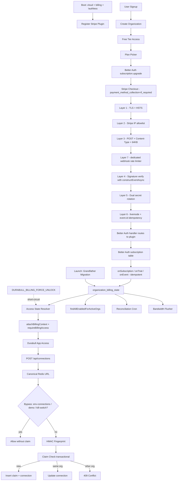
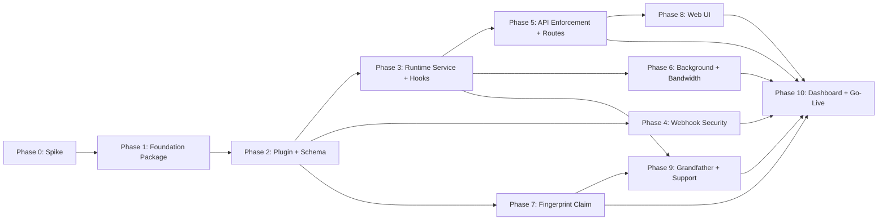

# Stripe Subscription Billing Plan

## Goal

Add self-serve Stripe subscription billing for Durabull Cloud while keeping local and self-hosted deployments free of billing enforcement. Billing is organization-scoped, not user-scoped.

The launch model should be low-friction:

- Real Free tier.
- Low-cost paid plans.
- Generous seats.
- Card-free 14-day paid-plan trials.
- Environment, connection, monitored queue, alert, and bandwidth guardrails.
- No job count or job retention limits.
- One-week payment grace before paid account lockout.
- Stripe-hosted UI and Better Auth Stripe integration wherever practical.
- Duplicate Redis connection protection so users cannot reset trials by creating new organizations with the same Redis connection string.

## Key Product Decisions

- Billing applies only to Durabull-hosted cloud mode.
- Local development and self-hosted production bypass all plan checks.
- New organizations start on Free immediately.
- Paid plans can be trialed for 14 days without a payment method.
- If a paid trial expires without a payment method, automatically fall back to Free when usage fits Free limits.
- If trial-expired usage exceeds Free limits, lock paid surfaces and explain what must be removed or upgraded.
- Active paid customers can be past due for one week before lockout.
- There is no Enterprise plan.
- Business is the highest public plan and should feel enterprise-grade without requiring sales.
- Cloud mode and authless mode are mutually exclusive: the API must refuse to boot whenever `DURABULL_CLOUD === true && DURABULL_AUTHLESS === true`, regardless of `DURABULL_BILLING_ENABLED`. (A cloud deploy with authless is never desirable, even temporarily, so the rule is independent of the billing toggle.)
- A boot-time kill switch (`DURABULL_BILLING_FORCE_UNLOCK=true`) makes `assertBillingAccess` always allow, for incident response. Its activation must emit a startup warning log line and a daily reminder.

## Existing-Organization Grandfathering (Launch Day Policy)

Production already has organizations whose usage exceeds Free limits. They must not be locked at deploy time.

On the first cloud billing deploy, a one-time migration must:

1. Insert an `organization_billing_state` row for every existing organization.
2. Set `access_state = 'grandfathered_trial'`, `last_checked_status = 'grandfathered_trial'`, `grace_ends_at = deploy_time + 30 days`. The Durabull `access_state` enum value `grandfathered_trial` is the marker; the resolver branches on it directly. `trialing` is reserved for orgs with a real Stripe `trialing` subscription.
3. Snapshot each org's current usage (connections, environments, queues, alert rules, members) into `organization_billing_state.metadata.grandfatherUsageSnapshot` so the resolver can apply per-org synthetic limits derived from launch-day reality (see Plan Limits → `grandfathered_trial`).
4. Email each org's owner with the grandfather notice and a link to start a real paid trial or downgrade explicitly to Free.
5. After 30 days, a scheduled reconciliation transitions any grandfathered org that has not subscribed to:
   - Free if current usage fits Free.
   - `locked` with a clear UI explaining the cleanup path if it does not.

No card is collected for the grandfather period. The state behaves like a regular trial for access purposes but does not write to Stripe.

## Why `stripeCustomerId` Belongs On Organization

Durabull billing is an organization concern. The Stripe Customer maps to `organization`, not `user`.

For Durabull:

- `organization.stripeCustomerId` is populated lazily at first `subscription.upgrade`.
- All subscription operations pass `customerType: "organization"` and `referenceId = organization.id`.
- No user-scoped subscription flows are exposed.
- `user.stripeCustomerId` exists in the schema (Better Auth Stripe always adds it) but is **never populated and never used**. `createCustomerOnSignUp` is explicitly `false`.

This prevents accidental user-billing semantics from leaking into a multi-user organization product. The `authorizeReference` callback enforces that only org owners/admins can mutate subscriptions for a given `referenceId`.

## Current Codebase Fit

Relevant current files:

- API composition: `apps/api/src/app.ts`.
- Auth route forwarding to Better Auth: `apps/api/src/routes/auth.ts`.
- Session and organization context: `apps/api/src/middleware/auth.ts`.
- Connection ownership middleware: `apps/api/src/middleware/connection.ts`.
- Better Auth configuration: `packages/auth/src/index.ts`.
- Better Auth client: `packages/auth/src/client.ts`.
- Organization schema: `packages/dal/src/db/schemas/organization/schema.ts`.
- Redis connection schema: `packages/dal/src/db/schemas/redis-connection/schema.ts`.
- Redis connection repository: `packages/dal/src/repositories/redis-connection.ts`.
- Alert monitor background loop: `apps/api/src/lib/alert-monitor.ts`.
- Org setup UI: `apps/web/src/routes/setup-organization.tsx`.
- App shell and navigation: `apps/web/src/routes/__root.tsx`.
- Connections UI: `apps/web/src/routes/$orgSlug.connections.tsx`.
- Team UI: `apps/web/src/routes/$orgSlug.team.tsx`.

Important existing constraints:

- `redis_connection.url` is encrypted.
- Redis URL encryption uses random IVs, so ciphertext cannot be compared for duplicate detection.
- Background alert evaluation bypasses HTTP middleware, so billing lockout must be applied there explicitly in cloud billing mode.
- Better Auth already owns `/api/auth/*`, so the Better Auth Stripe plugin can naturally expose `/api/auth/stripe/webhook` and subscription endpoints.

## Pricing And Packaging

### Free

`$0/mo`

- 10 seats included.
- 1 environment.
- 1 Redis connection.
- 5 monitored queues.
- 3 alert rules.
- Email alerts only.
- 5 GB/month included Durabull API/websocket transfer.
- No job count limit.
- No job retention limit.

Purpose: evaluation, hobby use, small internal tools, and a graceful landing place after a paid trial expires.

### Starter

`$12/mo` or `$120/year`

- 25 seats included.
- 2 environments.
- 3 Redis connections total.
- 25 monitored queues.
- 10 alert rules.
- Email and basic Slack alerts.
- 50 GB/month included Durabull transfer.
- No job count limit.
- No job retention limit.

Purpose: small production teams with two environments, such as staging and production.

### Team

`$39/mo` or `$390/year`

- 100 seats included.
- 3 environments: development, staging, production.
- 10 Redis connections total.
- 150 monitored queues.
- 50 alert rules.
- Email, Slack, webhook, PagerDuty/Opsgenie-style destinations as integrations mature.
- 250 GB/month included Durabull transfer.
- RBAC/team administration surfaces.

Purpose: default production plan.

### Business

`$99/mo` or `$990/year`

- 250 seats included.
- 3 current environments plus future custom environment labels if supported.
- 25 Redis connections.
- 500 monitored queues.
- 250 alert rules.
- 1 TB/month included Durabull transfer.
- Advanced RBAC, audit log, SSO-ready packaging when supported.
- Priority support language.

Purpose: larger operational teams without a sales-assisted enterprise motion.

## What Not To Meter

Do not meter:

- Job count.
- Job retention.
- Job states stored in customer Redis.

Durabull is not paying for the customer’s BullMQ job storage. The customer’s Redis instance owns that cost.

Do meter or limit:

- Durabull-hosted API/websocket transfer.
- Number of configured environments.
- Redis connections.
- Monitored queues.
- Alert rules.

Bandwidth should be generous and non-punitive:

- Warn at 75%, 90%, and 100%.
- Continue service through the current month unless there is obvious abuse.
- If a customer exceeds transfer for two consecutive months, ask them to upgrade.
- Do not add automatic bandwidth overage billing in phase 1.

## Better Auth Stripe Integration

Use `@better-auth/stripe` as the primary Stripe integration unless implementation testing exposes a blocker (see Verification Spike).

### Version Pinning

Pin both:

- `stripe@^22.0.0` in `apps/api` and `packages/auth` dependencies.
- Stripe API version `2026-03-25.dahlia` in the Stripe client constructor.

`@better-auth/stripe` must be pinned to the exact version verified against installed `better-auth@^1.4.9` during the implementation spike.

### Plugin Registration Conditions

The Stripe plugin is registered in `createAuth()` **only when**:

```
env.DURABULL_CLOUD === true &&
env.DURABULL_BILLING_ENABLED === true &&
env.DURABULL_AUTHLESS !== true
```

If any check fails, no Stripe plugin is added to the Better Auth instance. This guarantees:

- Self-hosted/local/authless deployments never expose `/api/auth/stripe/webhook` or any subscription endpoint.
- The auth handler returns the standard Better Auth 404 for unmounted plugin routes in non-cloud modes.

If `DURABULL_CLOUD === true && DURABULL_AUTHLESS === true`, the API throws at boot with a descriptive error and refuses to start. This is independent of `DURABULL_BILLING_ENABLED` — see the env module's mutual-exclusion assertion.

### Plugin Order

Plugin order in `createAuth()` must be:

```
plugins: [
  organization({ ... }),
  ...(cloudBillingEnabled ? [stripe({ ... })] : []),
]
```

The organization plugin must be registered **before** the Stripe plugin so the Stripe plugin can extend the organization schema correctly.

### Plugin Configuration

```
stripe({
  stripeClient,
  stripeWebhookSecret: env.STRIPE_WEBHOOK_SECRET,
  createCustomerOnSignUp: false, // never create user customers
  subscription: {
    enabled: true,
    plans: [...], // see Plan Limits
    authorizeReference: async ({ user, referenceId, action }) => {
      // covers all four documented actions:
      // 'upgrade-subscription' | 'cancel-subscription' | 'restore-subscription' | 'list-subscription'
      const m = await memberRepository.findByUserAndOrg(user.id, referenceId)
      return m?.role === 'owner' || m?.role === 'admin'
    },
    getCheckoutSessionParams: async ({ plan }) => {
      if (!plan.freeTrial?.days) {
        return { params: { payment_method_collection: 'if_required' } }
      }
      // The trial_period_days line is required as a workaround for
      // better-auth/better-auth#9129 (`subscription_data` overrides shallow-
      // merged the plugin's internally generated `trial_period_days` and
      // silently disabled the trial). Fixed in PR #9474 (2026-05-06). The
      // implementation must verify, against the spike-pinned plugin version,
      // that the trial badge appears on the Checkout page; if the bug is
      // present, this re-emit keeps trials working. The line is safe to
      // keep on a fixed plugin too.
      //
      // `trial_settings.end_behavior.missing_payment_method = 'pause'` is
      // mandatory: without it, Stripe defaults to canceling the
      // subscription when a card-free trial expires, sending
      // `customer.subscription.deleted` instead of
      // `customer.subscription.paused`. The entire `paused` branch of the
      // access-state resolver assumes pause behavior and will not fire
      // otherwise.
      return {
        params: {
          payment_method_collection: 'if_required',
          subscription_data: {
            trial_period_days: plan.freeTrial.days,
            trial_settings: {
              end_behavior: { missing_payment_method: 'pause' },
            },
          },
        },
      }
    },
    onSubscriptionComplete: ...,
    onSubscriptionCreated: ...,
    onSubscriptionUpdate: ...,
    onSubscriptionCancel: ...,
    onSubscriptionDeleted: ...,
  },
  organization: { enabled: true },
  onEvent: async (event) => { /* Durabull-specific events, idempotent by event.id */ },
})
```

`createCustomerOnSignUp` is explicitly `false`. `user.stripeCustomerId` exists in the schema (added by the plugin) but is never populated or used. Org-scoped Stripe Customers are created lazily at first `subscription.upgrade`.

### Lifecycle Hooks

Use the plugin's actual hooks; do not invent names:

| Hook | When it fires | Durabull use |
|------|----------------|---------------|
| `onSubscriptionComplete` | Checkout completed and subscription persisted | Promote `organization_billing_state` to `trialing` or `active` |
| `onSubscriptionCreated` | Subscription created outside Checkout (Stripe Dashboard) | Reconcile to active |
| `onSubscriptionUpdate` | Any subscription change webhook | Re-project state |
| `onSubscriptionCancel` | Cancellation requested (period-end or immediate) | Set banner copy |
| `onSubscriptionDeleted` | Subscription fully deleted in Stripe | Lock or downgrade-to-Free per policy |
| `freeTrial.onTrialStart` | Trial begins | Email + analytics event |
| `freeTrial.onTrialEnd` | Trial ends with conversion | No-op (handled by subscription update) |
| `freeTrial.onTrialExpired` | Trial ends without conversion | Apply downgrade-to-Free or lock |

Card-free trial fallback logic (downgrade to Free if usage fits, otherwise lock) belongs in `onTrialExpired`, not `onTrialEnd`. This is the critical distinction.

### `onEvent` Use

Wire `onEvent` for non-subscription Stripe events that Durabull-specific policy reads:

- `invoice.paid`
- `invoice.payment_failed`
- `invoice.finalization_failed`
- `invoice.payment_action_required`
- `customer.subscription.paused`
- `customer.subscription.resumed`
- `customer.subscription.trial_will_end`

Every `onEvent` handler must be idempotent: wrap with `withStripeEventIdempotency(event, ...)` (defined in Data Model → `stripe_event_log` — Mandatory Dedupe Table). The wrapper inserts into `stripe_event_log` with `ON CONFLICT DO NOTHING` and short-circuits on duplicate `event.id`.

### `authorizeReference` Surface

The callback must explicitly handle all four documented actions:

- `upgrade-subscription`
- `cancel-subscription`
- `restore-subscription`
- `list-subscription`

For each: the user must be an org `owner` or `admin` in `referenceId`.

### Card-Free Trial Mechanics

Required Checkout behavior the implementation must guarantee:

- `payment_method_collection=if_required` on the Checkout Session.
- 14-day trial via the plugin's `freeTrial.days` (single source of truth — see Trial Length below).
- `subscription_data.trial_settings.end_behavior.missing_payment_method = 'pause'` is set on the Checkout Session **and** in the Stripe Dashboard's default subscription settings (so Dashboard-created subscriptions and edge-case API-created subscriptions pause instead of cancel).
- Stripe sends `customer.subscription.paused` when the trial expires without a payment method.
- Stripe Customer Portal is used for payment method updates, invoice history, plan changes, and cancellation.

The `trial_settings.end_behavior.missing_payment_method = 'pause'` value requires Stripe API version `2022-08-01` or later. The plan pins `2026-03-25.dahlia` (see Version Pinning), which satisfies this; if the API version is rolled back, pause behavior silently regresses to cancel.

#### Trial Length — Single Source of Truth

Trial length is configured **once** in the `freeTrial.days` field on each plan in the plugin config. The `getCheckoutSessionParams` re-emits `trial_period_days: plan.freeTrial.days` only because of the merge bug described above; it must read from the plan, never hardcode a number. Tests assert that the rendered Checkout Session's `trial_period_days` matches the plan's `freeTrial.days`.

#### Plan-Switching `successUrl` Rewrite

Better Auth Stripe rewrites the supplied `successUrl` to an intermediate endpoint that handles the race between Checkout completion and webhook processing, then redirects to the original URL. Because of this:

- `apps/web/src/routes/$orgSlug.billing.success.tsx` is the **post-rewrite** target. The user lands there after the plugin's intermediate hop; subscription status is already up to date when this route renders.
- Tests must verify that this route receives a valid post-rewrite request; the agent must not invent a separate `/billing/start-success` intermediate.

#### Verification Spike Tests for the Trial Path

In addition to the spike tests already listed in Rollout step 0, the spike must explicitly verify:

1. The Stripe Checkout page renders the trial badge (visual confirmation that the `freeTrial` survived the merge into `subscription_data`).
2. Letting the trial expire produces `customer.subscription.paused`, **not** `customer.subscription.deleted` or `incomplete_expired`.
3. After pause, adding a payment method through the Customer Portal produces `customer.subscription.resumed` and the access state returns to `active`.

If any of those fail, fall back to:

- A small custom Checkout-start endpoint that creates the Stripe Checkout Session directly with the required parameters (`payment_method_collection`, `trial_period_days`, `trial_settings.end_behavior.missing_payment_method`).
- Better Auth Stripe still owns subscription storage, the Customer Portal session, and webhook processing.

### Trial Across Plan Switching

Decision: trial users who switch plans (Team → Business mid-trial) keep their existing trial countdown. Implementation must pass the existing `subscriptionId` to `subscription.upgrade` and verify Stripe preserves `trial_end`.

### Organization Deletion

Better Auth Stripe blocks organization deletion when an active subscription exists. The team UI and any future delete-org flow must surface this constraint with clear copy: "Cancel your active subscription before deleting this organization."

### Built-In Trial Abuse Prevention

The plugin includes per-**user** trial-abuse prevention: once a user has had any trial across all plans (tracked by `trialStart`/`trialEnd` on prior subscription rows), future trial requests for that user return zero trial days. This is a useful first layer but is **not sufficient** on its own, because the user can create a new organization and the trial-abuse check still happens on the user, not the org — but a different user as owner of a new org can still get a fresh trial. The Duplicate Redis Connection fingerprint check (below) keys on the Redis URL itself and is the second, required layer.

## Stripe Dashboard Setup

Create Stripe Products and Prices:

- Starter monthly/yearly.
- Team monthly/yearly.
- Business monthly/yearly.

Free is not a Stripe subscription in phase 1.

Configure Billing:

- Customer Portal with payment method management, invoices, plan changes (monthly ↔ yearly within and across plans), and cancellation at period end.
- Tax ID collection only if needed for go-live region; otherwise defer to phase 2.
- Trial ending reminder 3 days before trial end.
- Payment failed email sent immediately.
- Revenue recovery emails during the 7-day grace window.
- Smart Retries (or equivalent custom retries) bounded to one week so retry exhaustion aligns with Durabull's grace policy.
- Set `STRIPE_CUSTOMER_PORTAL_CONFIGURATION_ID` env var only if the default Portal configuration needs deviation (e.g. enforcing specific plan groups).

After final retry, Stripe may move the subscription to `unpaid` or leave it `past_due`. Durabull's `onSubscriptionUpdate` + access-state resolver derives the user-facing state; lockout fires at `grace_ends_at`.

### Stripe Emails vs Durabull Emails

Phase 1 relies on Stripe-owned customer emails for monetary events (trial ending, payment failed, recovery, receipts). Durabull-side email through `@durabull/email` is reserved for non-monetary events that Stripe does not send:

- Grandfather period started / ending soon.
- Auto-downgrade to Free notice.
- Auto-lock notice when usage exceeds Free at trial end.
- Approaching plan limits (75/90% of bandwidth).

These Durabull emails are scoped behind `isEmailConfigured()` and are no-ops when the email service is not provisioned.

## Data Model

### Better Auth Stripe Schema (Owned by the Plugin)

Better Auth Stripe owns these schema changes. Run `npx auth generate` and check the produced Drizzle migrations into `packages/dal/src/db/migrations/`:

- Adds `user.stripeCustomerId` (nullable, unused — see plugin configuration).
- Adds `organization.stripeCustomerId` (nullable, populated lazily at first `subscription.upgrade`).
- Adds a new `subscription` table with the documented fields: `plan`, `referenceId`, `stripeCustomerId`, `stripeSubscriptionId`, `status`, `periodStart`, `periodEnd`, `cancelAtPeriodEnd`, `cancelAt`, `canceledAt`, `endedAt`, `seats`, `trialStart`, `trialEnd`, `billingInterval`, `stripeScheduleId`.

Do not define a parallel `durabull_subscription` table. The plugin's `subscription` table is the source of truth for Stripe state. Durabull state lives in `organization_billing_state` (below).

### Durabull Billing State

Add `organization_billing_state` for Durabull-only policy:

- `organization_id` primary key, `references(organization.id, { onDelete: 'cascade' })`.
- `access_state`: `free | trialing | grandfathered_trial | active | past_due_grace | locked`.
- `free_started_at`.
- `past_due_started_at`.
- `grace_ends_at` (also used for grandfathered trial end).
- `access_locked_at`.
- `bandwidth_period_start` (always the first second of the current UTC month).
- `bandwidth_period_end` (first second of the next UTC month).
- `bandwidth_bytes_used`.
- `bandwidth_warning_sent_at`.
- `last_checked_subscription_id`.
- `last_checked_status`.
- `last_synced_at`.
- `last_processed_stripe_event_id` (latest event id observed for this org; informational/monitoring only — **not** the dedupe source of truth, see `stripe_event_log` below).
- `metadata` (jsonb; used for support-tool audit entries such as claim transfers).
- `created_at`, `updated_at`.

Bandwidth period is calendar month UTC for every plan (paid orgs and Free alike) because Free has no Stripe subscription anniversary to align to. Period rolls over via a scheduled cron at month boundary.

#### `stripe_event_log` — Mandatory Dedupe Table

The plugin handles its own dedupe for the four built-in subscription events (`checkout.session.completed`, `customer.subscription.created/updated/deleted`). Every Durabull-side handler — every lifecycle hook (`onSubscriptionComplete`, `onSubscriptionCreated`, `onSubscriptionUpdate`, `onSubscriptionCancel`, `onSubscriptionDeleted`, `freeTrial.onTrialStart`, `onTrialEnd`, `onTrialExpired`) and every `onEvent` branch — runs side effects (state writes, emails, analytics) that must not fire twice for the same `event.id`. The per-org `last_processed_stripe_event_id` column is insufficient because two events for the same org can interleave, overwriting each other before a retry of the first arrives.

Add a small `stripe_event_log` table:

- `event_id` (text, primary key) — the Stripe `event.id`.
- `event_type` (text).
- `livemode` (boolean).
- `organization_id` (text, nullable; FK to `organization.id` with `onDelete: 'set null'` for forensics — events that arrive for a since-deleted org still want a record).
- `processed_at` (timestamp).
- `processing_duration_ms` (integer, nullable).

#### Idempotency Pattern

Every Durabull-side handler wraps its work in:

```ts
await withStripeEventIdempotency(event, async () => {
  // side effects: state writes, emails, analytics, plan re-projection.
})
```

`withStripeEventIdempotency`:

1. Inserts `stripe_event_log` with `event_id`, `event_type`, `livemode`, resolved `organization_id`, `processed_at = now`. The insert uses `ON CONFLICT (event_id) DO NOTHING`. If the insert affects zero rows, the event has already been processed and the handler returns immediately.
2. Otherwise runs the handler body.
3. After success, updates `organization_billing_state.last_processed_stripe_event_id` for monitoring.
4. On handler failure, the row in `stripe_event_log` is rolled back as part of the same transaction so a retry can re-attempt. (The wrapper opens its own transaction; handlers must be transaction-safe.)

#### Retention

`stripe_event_log` is append-only. A nightly cleanup job removes rows older than 90 days, matching the existing alert event retention pattern in `alert-monitor.ts`.

### Backfill Behavior

The `organization_billing_state` row for an existing organization is inserted in two cases:

1. **One-time migration at first cloud-billing deploy** — see "Existing-Organization Grandfathering" above. Every existing org gets `access_state = 'grandfathered_trial'`, `last_checked_status = 'grandfathered_trial'`, `grace_ends_at = deploy_time + 30 days`, and a snapshot of launch-day usage in `metadata.grandfatherUsageSnapshot`.
2. **Lazy upsert on first request** for any org that lacks a row after deploy (e.g. new orgs). Insert `access_state = 'free'`, `free_started_at = now`.

### Plan Limits

Create a centralized plan config in a new `@durabull/billing` package:

- `local` / `self_hosted`: unlimited, `billing.enforced = false`.
- `free`: 1 environment, 1 connection, 5 queues, 3 alert rules, 10 seats, 5 GB transfer.
- `starter`: 2 environments, 3 connections, 25 queues, 10 alert rules, 25 seats, 50 GB transfer.
- `team`: 3 environments, 10 connections, 150 queues, 50 alert rules, 100 seats, 250 GB transfer.
- `business`: 3+ environments, 25 connections, 500 queues, 250 alert rules, 250 seats, 1 TB transfer.
- `grandfathered_trial`: derived per-org from the org's pre-launch usage snapshot stored in `organization_billing_state.metadata`; all measured usage at launch is permitted until `grace_ends_at`.

Seats are enforced as warning-only in phase 1. Do **not** configure `seatPriceId` on any plan; Durabull does not use per-seat billing.

No plan has job count or job retention limits.

### `@durabull/billing` Package

Create a new internal package `packages/billing/` that owns:

- Plan config (limits, Stripe price ID mapping).
- The runtime billing service (`getBillingContext`, `assertBillingAccess`, `assertPlanLimit`, `shouldProcessBackgroundBillingWork`).
- The typed billing-error envelope (see API Enforcement).
- Stripe Customer Portal session helpers.

Both `apps/api` and `apps/web` import shared types from this package so the 402 envelope shape is consistent end-to-end.

## Runtime Billing Policy

All plan checks must go through one billing runtime policy in `@durabull/billing`.

### Billing Modes

Computed once at boot:

- `cloud_billing`: `DURABULL_CLOUD === true && DURABULL_BILLING_ENABLED === true && DURABULL_AUTHLESS !== true`.
- `self_hosted`: production with `DURABULL_CLOUD !== true`.
- `local`: non-production or local development.
- `disabled`: explicit `DURABULL_BILLING_ENABLED !== true`.

Boot must throw if `DURABULL_CLOUD === true && DURABULL_AUTHLESS === true`, independent of `DURABULL_BILLING_ENABLED`. The check lives in the env module so every entry point (api server, workers, scripts) hits it before any code reads cloud-specific config.

### Kill Switch

When `DURABULL_BILLING_FORCE_UNLOCK === true`, `assertBillingAccess` always allows and `assertPlanLimit` always returns `ok`. The mode log line at boot must include `BILLING_FORCE_UNLOCK=ACTIVE`, and a recurring warning (every 6h) must log while the flag is set. Bandwidth accounting still runs; only enforcement is suppressed.

### What `cloud_billing` Enforces

Only `cloud_billing` enforces:

- Subscription status.
- Plan limits.
- Dunning lockout.
- Bandwidth warnings.
- Stripe lifecycle state.
- Billing-based alert monitor filtering.

### Behavior in Non-Cloud Modes

For `self_hosted`, `local`, and `disabled`:

- Return a synthetic unlimited plan.
- Set `billing.enforced = false`.
- Allow all plan gates.
- Do not register the Stripe plugin in Better Auth.
- Do not mount `/api/billing/*` routes.
- Do not create Stripe Customers, Checkout Sessions, Customer Portal sessions, or subscription rows.
- Do not return `402`.
- Do not filter alert monitor work for billing.
- Hide or de-emphasize paid upgrade UI in the web app.

### Central Service Methods

- `getBillingContext(organizationId): BillingContext` — pure projection of state for a single org.
- `assertBillingAccess(context): void | throws PaymentRequiredError`.
- `assertPlanLimit(context, limitKey, currentUsage): void | throws PlanLimitExceededError`.
- `shouldProcessBackgroundBillingWork(context): boolean`.
- `resolveStripeSubscriptionToBillingContext(orgId): Promise<BillingContext>` — re-pulls subscription + state and re-derives access; used by `/api/billing/sync` and the reconciliation cron.

Never scatter `if self-hosted` checks throughout routes. The bypass belongs in these central methods.

### Access-State Resolver

`getBillingContext` derives `access_state` from the Better Auth `subscription` row(s) for the org plus `organization_billing_state`, in this precedence order:

1. If kill switch is on → `active` (synthetic, unlimited plan).
2. If `organization_billing_state.access_state === 'grandfathered_trial'` and `now < grace_ends_at` → `grandfathered_trial`. Limits come from `metadata.grandfatherUsageSnapshot`; all measured launch-day usage is permitted. The 30-day grandfather cron flips this row to `free` or `locked` once `now >= grace_ends_at`.
3. If `organization_billing_state.access_state === 'grandfathered_trial'` and `now >= grace_ends_at` and the cron hasn't run yet → resolver re-evaluates as if Stripe state alone applied (i.e., falls through to the next branches). The cron is the canonical writer; the resolver fail-safe only short-circuits the brief gap between expiration and the cron tick.
4. Subscription `status === 'trialing'` → `trialing`.
5. Subscription `status === 'active'` and not `past_due` → `active`.
6. Subscription `status === 'past_due'` and `now < grace_ends_at` → `past_due_grace`.
7. Subscription `status === 'past_due'` and `now >= grace_ends_at` → `locked`.
8. Subscription `status === 'paused'`:
   - If usage fits Free → `free` (auto-downgrade record applied).
   - Else → `locked`.
9. Subscription `status === 'unpaid' | 'canceled' | 'incomplete_expired'`:
   - If usage fits Free → `free`.
   - Else → `locked`.
10. Subscription `status === 'incomplete'` → `locked`.
11. No subscription row → `free`.

This ordering is the single source of truth for access policy. The implementation must include a unit test matrix covering every Stripe status × usage-fits-Free combination.

### Billing Error Envelope

All `402` responses use this exact shape and are exported as a TypeScript type from `@durabull/billing`:

```
{
  error: 'PaymentRequired',
  code: 'BILLING_LOCKED' | 'PLAN_LIMIT_EXCEEDED' | 'TRIAL_EXPIRED' | 'PAST_DUE_LOCKED' | 'GRANDFATHER_EXPIRED',
  message: string,
  billing: {
    state: AccessState,
    plan: 'free' | 'starter' | 'team' | 'business' | 'grandfathered_trial',
    limit?: { key: string, allowed: number, current: number },
    graceEndsAt?: string,    // ISO8601
    upgradeUrl: string,      // org-scoped billing route
    portalUrl?: string,      // billing portal session URL when available
  }
}
```

The web app's TanStack Query error normalizer recognizes this shape and routes the user to billing UI instead of showing a generic toast.

## Access Policy

Cloud billing mode only. The resolver order in "Access-State Resolver" above is canonical; this section describes the user-visible effects.

### Per-State Behavior

- `free`: limited but usable forever.
- `trialing`: full selected-plan access until Stripe `trialEnd`.
- `grandfathered_trial`: usage-snapshot-permissive access until `grace_ends_at` (per-org limits come from launch-day snapshot, not a plan tier).
- `active`: full paid-plan access.
- `past_due_grace`: full access with persistent banner and billing CTA.
- `locked`: see "Locked Access" below.

### Multi-Organization Users

Billing is per-organization. A user who is a member of orgs A (locked) and B (active) retains full access to B. The lock screen for A must include "Switch organization" as a primary action and must not interfere with the global Better Auth organization switcher.

### Locked Access — Allowed

- Sign in / sign out.
- Switching organizations (`POST /api/auth/organization/set-active`).
- Reading session and `/api/app/config`.
- Reading `/api/team/members` (needed for the org switcher and lock-screen UI).
- Reading `/api/billing/status`.
- All Better Auth subscription mutation endpoints (`subscription.upgrade`, `subscription.billingPortal`, `subscription.cancel`, `subscription.restore`, `subscription.list`).
- Durabull billing recovery endpoints (`/api/billing/sync`, `/api/billing/downgrade-to-free`).

### Locked Access — Blocked

- Redis connection management (create/update/delete; reads of connection list remain allowed so the UI can show what would be removed).
- Queues.
- Jobs.
- Scheduled jobs.
- Redis keys.
- Analytics.
- Workers.
- Alerts (rules and event reads).
- Team management writes (invite, role change, remove member, cancel/resend invitation). Enforced via Better Auth `databaseHooks` on `member` and `invitation`, not via HTTP middleware (see "Team Management Enforcement (Auth Plugin Hooks)" in API Enforcement). Cross-org invitation **acceptance** by a member of a locked org remains allowed so a user can recover into another org.

Return `402 Payment Required` with the structured billing envelope (see "Billing Error Envelope") in cloud billing mode only.

### State-Transition Notes

Common Stripe transitions that must be handled:

- `trialing` → `past_due` directly when the first invoice fails after trial auto-charge.
- `paused` → `active` when a payment method is added through the Customer Portal.
- `active` → `past_due` → `unpaid` after Stripe Smart Retries exhaust.
- `past_due` → `active` when `invoice.paid` arrives.

`onSubscriptionUpdate` plus the `onEvent` handlers above must reproject `organization_billing_state` for every transition.

## Trial Flow

1. User signs up.
2. User creates organization.
3. Organization enters Free immediately (`organization_billing_state` lazily inserted).
4. App shows optional CTA: "Start a 14-day Team trial, no credit card required."
5. If owner starts a trial, call Better Auth Stripe `subscription.upgrade`:
   - `plan`: selected plan.
   - `customerType: "organization"`.
   - `referenceId`: active organization ID.
   - `successUrl`: org billing page (`/{orgSlug}/billing?from=checkout`).
   - `cancelUrl`: org billing page (`/{orgSlug}/billing?canceled=1`).
   - `seats`: informational; not used for per-seat billing.
6. `getCheckoutSessionParams` sets `payment_method_collection: 'if_required'` on the Stripe Checkout Session.
7. Better Auth creates the Checkout Session and returns the redirect URL.
8. Stripe sends webhooks to `/api/auth/stripe/webhook`.
9. Better Auth updates the `subscription` table.
10. Durabull's `onSubscriptionComplete` and `onSubscriptionUpdate` reproject `organization_billing_state`. Every handler runs through the `event.id` idempotency check before writing.
11. Web app reflects new trial status from `GET /api/billing/status`.

If Checkout is abandoned, the organization remains on Free. Better Auth Stripe creates no subscription row for an abandoned Checkout.

## Trial Expiration

When a card-free trial ends without a payment method:

1. Stripe transitions the subscription to `paused` and emits `customer.subscription.paused`.
2. The Stripe plugin invokes `freeTrial.onTrialExpired`.
3. Durabull evaluates the org's current usage against Free limits.
4. If usage fits Free:
   - Set `access_state = 'free'`.
   - Email the owner with the downgrade notice and a one-click upgrade link.
   - Show a banner in the web app.
5. If usage exceeds Free:
   - Set `access_state = 'locked'`.
   - Email the owner with the lock notice listing exact limits exceeded and required cleanup.
   - The web UI locked screen explains current usage, Free limits, the specific resources to remove, and the "add payment to resume paid plan" CTA.

Idempotency: the handler uses `event.id` deduplication so retried webhooks do not re-fire the email.

## Payment Failure Flow

When a paid renewal fails:

1. Better Auth Stripe `onEvent` receives `invoice.payment_failed`.
2. Idempotency check: `withStripeEventIdempotency(event, ...)` short-circuits on duplicate `event.id`.
3. Durabull sets `past_due_started_at` if absent.
4. Durabull sets `grace_ends_at = past_due_started_at + 7 days`.
5. App shows persistent payment-failed banner.
6. Stripe Smart Retries continue.
7. If `invoice.paid` arrives before `grace_ends_at`:
   - Clear `past_due_started_at` and `grace_ends_at`.
   - Restore `active` access.
8. If `now >= grace_ends_at` (detected by `onSubscriptionUpdate`, the reconciliation cron, or any access check):
   - Transition to `locked`.

## Plan Switching During Trial

Switching plans mid-trial (Team → Business) preserves the trial countdown.

1. UI calls `subscription.upgrade({ plan: 'business', subscriptionId: existing, ... })`.
2. Better Auth Stripe updates the existing Stripe subscription in place.
3. The Stripe subscription keeps the same `trial_end`.
4. Webhook reprojects `organization_billing_state.last_checked_status`.

Verification spike must confirm Stripe preserves `trial_end` through this flow; if not, the upgrade endpoint must explicitly set `trial_end` before mutating.

## API Enforcement

### Middleware

Add three Hono middlewares in `apps/api/src/middleware/billing.ts`:

- `attachBillingContext` — reads `organizationId` from context, fetches the billing context once per request, sets `c.set('billing', context)`.
- `requireBillingAccess` — calls `assertBillingAccess`; returns the 402 envelope if locked.
- `requirePlanLimit(limitKey, getUsage)` — calls `assertPlanLimit`; returns 402 with `PLAN_LIMIT_EXCEEDED` if exceeded.

### Ordering

`attachBillingContext` requires `c.get('organizationId')` to already be set, so it must run after whichever middleware resolves the organization. The two existing patterns differ:

#### Pattern A — `/api/connections/*`, `/api/alerts/*`, `/api/team/*` (read), and other org-scoped prefixes

These mount `sessionMiddleware` at the app level (`app.ts`) and `requireOrganization` inside the route file (e.g. `connections.ts` line 20: `.use('*', requireOrganization)`).

For these prefixes, billing middleware is added **inside the route file**, immediately after the existing `.use('*', requireOrganization)` line, so the chain becomes:

```
sessionMiddleware (app-level)
  → requireOrganization (route-level, existing)
  → attachBillingContext (route-level, new)
  → requireBillingAccess (route-level, new)
  → handler
```

The agent must not move `requireOrganization` out of the route files for these prefixes; doing so would change error semantics (existing tests expect 403 on missing-org before any billing logic runs).

#### Pattern B — `/api/c/:connectionId/*`

The existing `createConnectionMiddleware` (`apps/api/src/middleware/connection.ts`) internally resolves the session, sets `organizationId`, **and** loads the connection in a single middleware. Splitting it would change error semantics. Therefore:

```
connectionMiddleware (existing — sets session + org + connection)
  → attachBillingContext (new)
  → requireBillingAccess (new)
  → handler
```

`attachBillingContext` runs after `connectionMiddleware` because that is the first point at which `organizationId` is available on the per-connection chain. This is a deliberate divergence from Pattern A's ordering and must be documented in the middleware's JSDoc so future readers don't try to "normalize" the order.

#### Shared Rules

- The plan does **not** introduce a new `requireOrganizationWithBilling` wrapper.
- `requireBillingAccess` always reads `c.get('billing')` set by `attachBillingContext`; it never re-fetches.
- In non-cloud-billing modes, `attachBillingContext` sets a synthetic unlimited context (`billing.enforced = false`), `requireBillingAccess` is a no-op, and per-route plan-limit checks short-circuit through the same context.

### Mount Targets (Exact)

Cloud billing middleware applies only on these prefixes, mounted after session/org resolution:

- `/api/connections/*` — protected.
- `/api/c/:connectionId/*` — protected.
- `/api/alerts/*` — protected (org-wide event feed and summary).

Team management writes are **not** mounted under `/api/team/*` and are not enforced at the HTTP layer. They live under `/api/auth/organization/*` (owned by Better Auth's organization plugin: `inviteMember`, `removeMember`, `updateMemberRole`, `cancelInvitation`, `resendInvitation`). Because `/api/auth/*` is exempted from billing checks (so the webhook and recovery actions stay reachable when locked), team writes must be enforced inside the auth pipeline itself — see "Team Management Enforcement (Auth Plugin Hooks)" below.

Explicitly **not** mounted on:

- `/api/auth/*` — including `/api/auth/stripe/webhook` and all subscription endpoints. Webhook delivery and recovery actions must never be locked out.
- `/api/auth/stripe/webhook` — additionally exempted from `authRateLimiter` (see below).
- `/api/billing/*` — see "API Routes" section.
- `/api/session` — needed for the locked UI.
- `/api/app/config` — needed for the locked UI.
- `/api/app/version`, `/api/health` — operational.
- `/api/team/members` (read) — needed for org switcher and locked-screen UI.

### Team Management Enforcement (Auth Plugin Hooks)

Locked organizations must not be able to invite members, change roles, remove members, cancel invitations, or resend invitations. Because all of these flow through `/api/auth/organization/*`, the HTTP-layer billing middlewares cannot enforce them without breaking the rest of the auth pipeline. The enforcement therefore lives in the Better Auth instance itself, in two places:

1. **Database hooks on the `member` and `invitation` tables.** Add a `databaseHooks` block in `createAuth()` that runs only when `cloudBillingEnabled === true`:

   ```ts
   databaseHooks: {
     member: {
       create: { before: assertBillingAccessForMemberWrite },
       update: { before: assertBillingAccessForMemberWrite },
       delete: { before: assertBillingAccessForMemberWrite },
     },
     invitation: {
       create: { before: assertBillingAccessForInvitationWrite },
       update: { before: assertBillingAccessForInvitationWrite },
       delete: { before: assertBillingAccessForInvitationWrite },
     },
   }
   ```

   Each `assertBillingAccess…` helper:

   - Resolves the target `organizationId` from the row being mutated.
   - Calls `getBillingContext(organizationId)`.
   - If `access_state === 'locked'`, throws `new APIError('FORBIDDEN', { code: 'BILLING_LOCKED', message: '…', billing: <envelope> })`. Better Auth surfaces the error to the client; the web app's TanStack Query normalizer recognizes the `code` and routes to `BillingLockedScreen`.
   - Allows accept/reject of an existing invitation regardless of access state, so a user can accept an invite to a non-locked org from a locked one. The hook distinguishes "create" (blocked when source org is locked) from status-only updates initiated by the invitee (allowed).

2. **Carve-outs.**

   - The hooks are no-ops when `billingMode !== 'cloud_billing'`.
   - The hooks are no-ops when `DURABULL_BILLING_FORCE_UNLOCK === true` (kill switch).
   - The hooks must not call back into Stripe or the billing portal (no network I/O in a DB hook); they read only `organization_billing_state` and the access-state resolver.

3. **402 envelope shape parity.** When the hook throws, the resulting error response payload includes the same `billing` block specified in "Billing Error Envelope". The web app's organization-mutation hooks (`useInviteMember`, `useRemoveMember`, `useUpdateMemberRole`, `useCancelInvitation`, `useResendInvitation` in `apps/web/src/hooks/use-organization.ts`) inspect the error response and route to `BillingLockedScreen` or `PlanLimitNotice` rather than showing a generic toast.

4. **Tests.**

   - Locked org cannot invite a member (Better Auth client returns `BILLING_LOCKED`).
   - Locked org cannot remove a member.
   - Locked org cannot change a member's role.
   - Locked org cannot resend / cancel an invitation.
   - **Member of a locked org can still accept an invitation to a different org** (cross-org invitation acceptance is critical for recovery flows when a single user owns multiple orgs).
   - Self-hosted / authless / disabled modes never invoke the hook.

5. **Future routes.** If `/api/team/*` ever grows write endpoints, those routes get the standard `requireBillingAccess` middleware. The auth-plugin hook remains the canonical enforcement point because Better Auth is the source of truth for member/invitation state.

### Stripe Webhook Path — Middleware Stack

`apps/api/src/app.ts` currently rate-limits `/api/auth/*` via `authRateLimiter` (50 req / 10s per IP). The webhook path is removed from that limiter and given its own hardened middleware stack:

```
// Skip authRateLimiter for the webhook path
app.use('/api/auth/*', async (c, next) => {
  const path = c.req.path
  if (
    path.includes('/get-session') ||
    path.includes('/session') ||
    path.endsWith('/stripe/webhook')
  ) return next()
  return authRateLimiter(c, next)
})

// Webhook-specific middleware (only when cloud billing is enabled)
if (cloudBillingEnabled) {
  app.use(
    '/api/auth/stripe/webhook',
    stripeWebhookIpAllowlist,          // Layer 2
    stripeWebhookStrictShape,          // Layer 3 (POST + Content-Type + 64 KB)
    stripeWebhookRateLimiter,          // Layer 7
  )
}
```

After these checks pass, the request reaches Better Auth's handler, which runs signature verification (Layer 4), Stripe-native multi-secret rotation (Layer 5; phase 1 leverages Stripe Dashboard's dual-active-secret window rather than an app-level overlay), livemode check and idempotency (Layer 6). See **Stripe Webhook Security (Defense in Depth)** below for the full layered model.

In non-cloud modes the Stripe plugin is not registered, so the path 404s and none of these middlewares are mounted. The authless catch-all 403 is therefore never reached on the webhook path because cloud mode is mutually exclusive with authless mode (boot assertion); cloud-without-billing simply 404s at the auth handler.

### Body-Limit and Signature Verification

Hono's `bodyLimit(1MB)` reads `Content-Length` but does not consume the request body. `auth.handler(c.req.raw)` passes the raw `Request`. Stripe webhook signature verification (which Better Auth Stripe handles internally) must therefore work without changes. This must be covered by a test that posts a signed payload through the full middleware chain.

### Enforcement Points

- **Connection count** — check in `redisConnectionRepository.create` (DAL) via a `assertPlanLimit('connections', ...)` callback supplied by the API layer. The repository becomes billing-aware via dependency injection rather than direct env reads.
- **Environment count** — in `connections.ts` POST/PATCH handlers, count distinct environments after applying the change and call `assertPlanLimit('environments', ...)`.
- **Monitored queue count** — in queue discovery/sync (per connection).
- **Alert rule count** — in alert rule create handler.
- **Bandwidth** — see "Bandwidth Metering" below.

Seats are warning-only in phase 1. Implement as a soft warning surfaced in the team UI; do not block invites.

### Bandwidth Metering

Implementation:

- Add an outermost Hono middleware after CORS/rate-limit that wraps the response, observes `Content-Length` on the final response (or counts streamed bytes for chunked responses), and increments an in-memory per-org counter.
- A 60s timer flushes counters to `organization_billing_state.bandwidth_bytes_used` using a single batched UPDATE.
- A 1h cron evaluates each org's `bandwidth_bytes_used` against the plan's transfer limit and fires emails at 75%, 90%, 100%.
- Calendar-month rollover: a cron at the first second of each UTC month resets `bandwidth_bytes_used = 0` and advances `bandwidth_period_start` / `bandwidth_period_end`.

Excluded from bandwidth accounting:

- `/api/health`, `/api/app/version`, `/api/app/config`.
- `/api/auth/*` (Better Auth traffic).
- `/api/telemetry/*` (Durabull-side telemetry ingestion).
- `/ingest/*` (PostHog proxy — passes through, not Durabull bytes).
- Stripe webhook traffic.

Phase 1 does not implement automatic bandwidth overage billing. Two consecutive months over the limit triggers a manual outreach playbook, not enforcement.

## Stripe Webhook Security (Defense in Depth)

`/api/auth/stripe/webhook` is the only public, unauthenticated endpoint we expose for billing. A forged or replayed event could grant a free subscription, hide a failed payment, or alter access state. Treat it accordingly.

The endpoint is hardened with **seven independent layers**. Each layer can fail open without enabling the next; an attacker must break every layer to compromise billing state.

### Layer 1 — TLS, HSTS, HTTPS-Only

- The API already sets `secureHeaders({ strictTransportSecurity: 'max-age=31536000; includeSubDomains' })`.
- The infrastructure (Cloudflare/edge) must reject plain HTTP for the API hostname. Document this in the cloud runbook.
- Stripe will not deliver webhooks to non-HTTPS endpoints; the Stripe Dashboard webhook config must specify `https://` and `STRIPE_WEBHOOK_URL_PROD` must be HTTPS-only.

### Layer 2 — Source IP Allowlist

Stripe publishes the canonical webhook source IP list at `https://stripe.com/files/ips/ips_webhooks.json`.

- A new module `apps/api/src/lib/stripe-webhook-ip-allowlist.ts` fetches and caches this list on boot and refreshes every 6 hours.
- The allowlist refresh respects the response's `ETag`/`Last-Modified` and falls back to a bundled snapshot file at `apps/api/src/lib/stripe-webhook-ips.snapshot.json` if the network fetch fails.
- The webhook handler middleware rejects any request whose client IP (extracted from `x-forwarded-for` / `cf-connecting-ip` / `x-real-ip`, identical to the rate-limit key extraction) is not in the allowlist with `403 Forbidden` and **no response body**.
- This layer is defense in depth only. A request that passes IP allowlist still has to pass signature verification (Layer 4). An IP-allowlist bypass alone never trusts the payload.
- A `DURABULL_STRIPE_WEBHOOK_IP_ALLOWLIST_MODE` env var controls behavior:
  - `enforce` (default in production): reject on miss.
  - `monitor`: log and emit metric, but still call signature verification.
  - `disabled`: skip the check entirely. Reserved for local Stripe CLI testing.
- The Stripe CLI's `stripe listen` connects from local IPs that are not on the allowlist, so local development uses `monitor` or `disabled`.

### Layer 3 — Strict Request Shape

Before Better Auth's plugin sees the request, a thin middleware on `/api/auth/stripe/webhook` only:

- Method must be `POST`. Anything else returns `405 Method Not Allowed` with no body.
- `Content-Type` must start with `application/json`. Otherwise `400`.
- `Stripe-Signature` header must be present. Otherwise `400`.
- Request body length must be ≤ `64 KB` (vs. the global 1 MB body limit). Stripe webhook payloads are well under this in practice; this prevents amplified DoS through the signature-verification CPU cost.

These checks fail fast with no expensive work and no information disclosure.

### Layer 4 — Cryptographic Signature Verification

This is the only layer that authorizes the payload. Better Auth Stripe's plugin internally calls `stripe.webhooks.constructEventAsync` with:

- The raw request body (preserved because Hono's `bodyLimit` does not consume the body and the auth handler receives `c.req.raw`).
- The `Stripe-Signature` header.
- `STRIPE_WEBHOOK_SECRET`.
- Default replay tolerance of 300 seconds. Plan does not extend this.

Implementation requirements:

- Never log the raw body or the `Stripe-Signature` header.
- Never trim, normalize, or re-encode the body before signature verification. The plan's API Enforcement section already commits to this; the webhook tests verify it.
- Signature failures must return `400` with body `Webhook signature verification failed` (Stripe ignores body content on non-2xx; this exact string aids debugging).
- Every signature failure increments a metric `stripe_webhook_signature_failures_total` and emits a structured log line with the source IP only (no body, no header, no event content).
- More than 5 signature failures from any single IP in 60 seconds fires a security alert.

### Layer 5 — Webhook Secret Rotation (Phase 1: Dashboard-Only; Phase 2: Dual-Secret)

A leak of `STRIPE_WEBHOOK_SECRET` is the highest-impact compromise, so rotation must be a documented operational procedure.

#### Phase 1 — Single-Secret Dashboard Rotation

Better Auth Stripe accepts a single `stripeWebhookSecret` and runs `stripe.webhooks.constructEventAsync` internally. There is no public hook to inject dual-secret retry without forking the plugin or replacing its webhook route. Phase 1 therefore uses Stripe's native multi-secret endpoint feature plus a controlled-window deploy:

1. **Stripe Dashboard supports multiple signing secrets per webhook endpoint.** Add the new secret in the Dashboard. Stripe begins signing every delivery with **both** old and new secrets simultaneously (the `Stripe-Signature` header carries multiple `v1=…` values).
2. The plugin's `constructEventAsync` accepts a `Stripe-Signature` header containing multiple signatures and considers verification successful if any one matches. So a deploy that flips `STRIPE_WEBHOOK_SECRET` from old to new has zero downtime as long as both secrets are configured in the Stripe Dashboard for the rotation window.
3. **Rotation procedure (documented in the cloud runbook):**
   1. In Stripe Dashboard, "Roll secret" on the webhook endpoint. Stripe activates a new signing secret. Both old and new secrets sign deliveries during the dual-active window (Stripe's default is 24 hours; configurable when rolling).
   2. Within that window, set `STRIPE_WEBHOOK_SECRET` to the new value in production env and redeploy.
   3. Verify the next webhook delivery succeeds (logs show signature-verified true).
   4. Allow Stripe's dual-active window to expire; the old secret is automatically deactivated.
4. **No `STRIPE_WEBHOOK_SECRET_NEXT` env var in phase 1.** Rotation is an env-flip + redeploy, not an env-overlay.
5. **Compensating controls during the rotation window:** Layer 2 (IP allowlist), Layer 3 (request shape), Layer 7 (rate limiter), and Layer 6 (livemode + idempotency) are all unaffected by the secret value and continue to filter forged or replayed traffic.

#### Phase 2 — Dual-Secret Overlay (Deferred)

If the team needs application-level control over which secrets are accepted (e.g. to revoke a leaked secret faster than Stripe's dual-active window allows), phase 2 ships one of:

- A pre-handler middleware that verifies the signature against `STRIPE_WEBHOOK_SECRET` and `STRIPE_WEBHOOK_SECRET_NEXT`, sets `c.set('verifiedStripeEvent', event)`, and **replaces** the auth handler call for `/api/auth/stripe/webhook` with a Durabull route that invokes the plugin's internal event-processing functions directly. This requires either a public API on `@better-auth/stripe` for "I've already verified this event" (does not exist as of the spike's pinned version) or a deliberate fork of the webhook route.
- Or a contribution upstream to Better Auth Stripe to accept an array of secrets.

Phase 2 is out of scope here. The Open Risks section flags this as deferred.

A boot-time assertion warns (does not fail) when `STRIPE_WEBHOOK_SECRET` matches a known-leaked-secret hash registered in `DURABULL_STRIPE_WEBHOOK_SECRET_REVOCATION_HASHES`, an optional comma-separated list of SHA-256 hashes of revoked secrets. This gives operators a way to fail-loud if a redeploy accidentally re-introduces a leaked secret.

### Layer 6 — Event Replay and Idempotency

Even a fully verified event could be a replay of a real older event captured by a man-in-the-middle (theoretical given TLS; practical only if a downstream proxy logs the body).

- Stripe's signature tolerance of 300 seconds already bounds the replay window.
- Beyond that, every `onEvent` and lifecycle handler dedupes on `event.id` via the mandatory `stripe_event_log` table (see Data Model). Duplicate event IDs are no-ops; cross-event interleaving cannot defeat the dedupe because the table has a per-event PK.
- Test mode and live mode events are never mixed: production validates `event.livemode === true` and rejects test events with `400`. Test mode (Stripe CLI, staging) does the inverse. This prevents an attacker with test-mode access from injecting events into a live system.

### Layer 7 — Dedicated Rate Limiter

The webhook path is exempt from `authRateLimiter` (which would block Stripe retries), but is **not unprotected**:

- A new `stripeWebhookRateLimiter` allows 200 req / 10 s per source IP (Stripe's documented peak delivery is well under this).
- It returns `429` on excess, signalling Stripe to retry with backoff per its standard retry semantics.
- The limiter is keyed by the same IP extraction logic as Layer 2 and is bypassed in dev/test as the existing rate limiters are.
- If the limiter is hit by an IP that also failed Layer 2's allowlist, the security alert fires immediately.

### Cross-Cutting Guarantees

- **No CORS**: the webhook is server-to-server. The existing `/api/*` CORS policy restricts allowed origins; the webhook path can also enforce no `Access-Control-Allow-Origin` because it is never called from a browser.
- **No cookies, no sessions**: the webhook handler never reads cookies and never sets them. Adding any future session middleware must explicitly skip `/api/auth/stripe/webhook`.
- **Path obscurity is not relied on**: the well-known path `/api/auth/stripe/webhook` is by design (so Better Auth and Stripe documentation match operator expectations). Security comes from signature, not obscurity.
- **Auth catch-all 403 bypass**: in production cloud mode, the Stripe plugin is registered, so `auth.handler` matches `/stripe/webhook` and the authless catch-all is never reached. In any non-cloud mode the plugin is not registered, so the path 404s.
- **Body integrity**: the verification spike (rollout step 0) includes a test that posts a known-signed payload through the full middleware stack (CORS → rate-limit-exempt → body-limit → secureHeaders → auth handler) and asserts the signature verifies. This guards against future middleware changes silently breaking the raw body.
- **Audit log**: every verified webhook writes one structured log line containing `event.id`, `event.type`, source IP, `event.livemode`, processing duration, and verified-signature flag — never the body or headers. Failed verifications log IP and reason code only.
- **No body in 5xx responses**: handler errors return `500` with body `Webhook handler error`. Detailed error context goes to the log, never the response.
- **Webhook URL secret in path (optional, deferred)**: prepending a per-environment opaque path segment (e.g. `/api/auth/stripe/webhook/<32-char-token>`) is sometimes used as a stealth layer. Phase 1 does not implement this because the seven layers above are stronger than path obscurity. Phase 2 may add it as a sealed-secret rotation drill.

### Threat Model Summary

| Threat | Layer(s) defeating it |
|--------|------------------------|
| Forged webhook from random attacker | 1, 2, 3, 4 |
| Replayed real event captured upstream | 4 (timestamp), 6 |
| Stolen `STRIPE_WEBHOOK_SECRET` | 2 (defense in depth), 5 (Stripe-Dashboard rotation window + revocation-hash boot warning), 7 (rate limit) |
| Cross-environment event injection (test → live) | 6 (`livemode` check) |
| Slowloris / large-body DoS | 3 (size + content-type), 7 |
| CPU-amplified signature-check DoS | 2 (IP allowlist drops first), 3, 7 |
| Browser-based attack (CSRF, XHR) | Cross-cutting (no CORS, no cookies) |
| Future middleware breaks raw body | Verification spike test, ongoing test |

If any single layer is breached, the others independently keep billing state safe.

## Background Processing

### Alert Monitor Lock Filtering

`apps/api/src/lib/alert-monitor.ts` today iterates by `connectionId` after `alertRuleRepository.findAllEnabled()`. Add a new repository method that performs the org-state filter at the database level so the monitor never opens Redis for a locked cloud org:

```
alertRuleRepository.findAllEnabledForActiveOrgs()
```

Implementation:

- Join `alert_rule` → `organization_billing_state` on `organization_id`.
- In cloud billing mode, return only rules whose org's `access_state IN ('free', 'trialing', 'grandfathered_trial', 'active', 'past_due_grace')`. Exclude `locked`.
- In non-cloud modes, behave identically to `findAllEnabled()` (no billing filter).

`runPollCycle` calls the new method via `shouldProcessBackgroundBillingWork(context)` to pick the right repository call. Per-rule re-checks are not required because the join guarantees only active orgs return rules.

### Other Background Work

Add two new periodic jobs in `apps/api/src/lib/`:

- **`billing-reconciliation.ts`** — every 10 minutes, picks orgs whose `last_synced_at` is older than 30 minutes, re-pulls their subscription from Stripe via `resolveStripeSubscriptionToBillingContext`, and reprojects state. Logs (without PII) anything where the recomputed state disagrees with the stored state.
- **`bandwidth-flusher.ts`** — every 60 seconds, drains the in-memory bandwidth counter map into the DB.

Both jobs guard their entire body with `if (billingMode !== 'cloud_billing') return` so they are no-ops in self-hosted/local/disabled deployments.

## Duplicate Redis Connection Abuse Prevention

Problem:

- Card-free trials make it easy to create a new org after a trial expires.
- Existing Redis URLs are encrypted with random IVs.
- Duplicate detection cannot compare encrypted URLs.

This system is the second of two layers — the first is Better Auth Stripe's built-in per-**user** trial-abuse prevention (per the plugin docs: "users can only get one trial per account across all plans"). Per-user prevention does not stop a user from creating a fresh organization and starting a fresh trial there, which is exactly why the Redis URL fingerprint claim system exists as a second layer keyed on the underlying Redis instance.

### Schema

Add `url_fingerprint` to `redis_connection`:

- `text` column, nullable until backfill completes, then `NOT NULL`.
- Value format: `fp_v1_<base64url(64 chars)>` so a future rotation can introduce `fp_v2_`.
- Indexed for lookup (`CREATE INDEX redis_connection_url_fingerprint_idx ON redis_connection(url_fingerprint)`).
- Computed as HMAC-SHA256(`DURABULL_CONNECTION_FINGERPRINT_SECRET`, canonical URL).
- Not reversible.

Add `redis_connection_claim`:

- `url_fingerprint` (text) primary key.
- `owning_organization_id` (references `organization.id`, `onDelete: 'set null'`). When the owning org is deleted, the FK is nulled rather than the claim row being removed; the claim row stays as an audit record. A null `owning_organization_id` is treated as `claim_status = 'released'` by the create/update assertion (i.e. another org may take it).
- `first_connection_id` (text — the originating connection; for forensics, not FK).
- `first_seen_at`, `last_seen_at`, `released_at` (timestamps).
- `claim_status`: `active | released | blocked`. A row with `owning_organization_id IS NULL` has `claim_status = 'released'`.
- `notes` (text, nullable — populated by support tool transfers).
- A DB trigger (or repository-level wrapper for PGlite parity) sets `claim_status = 'released'`, `released_at = now`, and appends a structured note when `owning_organization_id` transitions to NULL via a cascade-set-null. Implementations that cannot run triggers (PGlite) instead require org deletion to go through `organizationDeletionRepository.delete`, which performs the claim-release write inside the same transaction as the org row delete.

#### Why `set null` instead of `restrict`

`restrict` would block any org-delete (free, voluntary, or admin-driven) on any active claim, surfacing as an opaque FK violation. `set null` lets org deletion proceed; the claim row remains as a forensic record but no longer blocks reuse. Better Auth Stripe already blocks deletion of orgs with active subscriptions (see "Organization Deletion"), so a free org's voluntary delete is the only common path here, and it should not silently fail because of a claim.

#### Tests

- Deleting an org with active claims succeeds; the claim rows have `owning_organization_id = NULL` and `claim_status = 'released'`.
- After such a delete, another org can create a connection with the same Redis URL successfully.
- The claim's audit fields (`first_seen_at`, `notes`) survive the cascade for forensics.

### Bypass Conditions

The fingerprint/claim check is **bypassed entirely** in these cases (the implementation must verify each at runtime):

- `billingMode !== 'cloud_billing'`.
- `shouldUseEnvConnections() === true` (connections are admin-provisioned via env, not user-created).
- The canonical URL equals the canonicalization of `env.DURABULL_DEMO_ACCOUNT_REDIS_CONNECTION_STRING`.
- `env.DURABULL_BILLING_FORCE_UNLOCK === true`.

The bypass paths apply both to create-time claim assertion and to migration/backfill.

### Same-Org Policy

Within a single organization, a Redis URL **may** be reused across multiple connection rows (e.g. two named connections pointing at the same Redis). The claim system enforces only **cross-organization** uniqueness.

### Canonicalization

The canonical form is computed by `packages/billing/src/redis-url-canonical.ts`. It must produce the same fingerprint for any pair of URLs that ioredis would treat as connecting to the same logical Redis with the same credentials. Concrete rules:

1. **Scheme** — `redis://` (no TLS) or `rediss://` (TLS). `redis://...?tls=true` and `redis://...?ssl=true` and `redis+tls://` all normalize to `rediss://`. Any unknown variant rejects with `RedisUrlCanonicalizationError`.
2. **Host** — lowercased. Hostnames are kept as-is (no DNS lookup). IPv6 bracket notation preserved. IPs and hostnames are not unified.
3. **Port** — omitted if `6379`. Otherwise included.
4. **Database** — explicit integer `0..15`. `redis://h:6379`, `redis://h:6379/`, and `redis://h:6379/0` all normalize to db `0`. `?db=2` and `/2` both normalize to `/2`. Different db indexes on the same host **are different fingerprints**.
5. **User** — Redis 6 ACL default user. `default@`, `@`, and no user prefix all normalize to omitted user.
6. **Password** — percent-decoded then percent-encoded with a fixed RFC3986-unreserved set, so `%21` and `!` produce the same output. Passwords supplied via `?password=` are merged into the userinfo position.
7. **Query parameters** — `db` is **never** kept as a query parameter; it is always normalized into the path per rule 4. Of the remaining query parameters, only `family` is kept. Everything else (`tls`, `ssl`, `password`, `username`, `name`, `db`) is consumed into normalized fields (path or userinfo) and removed from the query. Remaining params (just `family` if present) are sorted lexicographically. URLs with no parameters left have no `?` in canonical form.
8. **Sentinel / Cluster URIs** — multi-host URIs (`redis-sentinel://h1,h2/...`, `redis+cluster://...`) are explicitly rejected in phase 1 with `RedisUrlCanonicalizationError` and a user-facing error directing to single-host Redis or Sentinel resolved at the client. This avoids fingerprint ambiguity. Phase 2 may add a canonical form by sorting host list.

The canonicalizer ships with a fixture suite covering every rule above, including negative cases.

### Logging Discipline

Never log canonical URLs, raw URLs, or fingerprints in normal operation. Errors surface only org IDs and connection IDs. Test assertions verify no log line emitted during normal create/update flows contains substrings of fingerprints or URLs.

### Repository Behavior

`redisConnectionRepository.create` and `.update`:

- Validate Redis URL (existing `validateRedisUrlForEnvironment`).
- Compute canonical URL and fingerprint (skips on bypass conditions).
- In a single DB transaction:
  - Read `redis_connection_claim` for the fingerprint.
  - If no row exists → insert claim with this org as owner, then insert connection.
  - If row exists and `claim_status === 'blocked'` → throw `RedisConnectionDuplicateClaimError` regardless of owner. (`blocked` is set only by the support tool when the system's investigated abuse and decided no org may claim this fingerprint.)
  - If row exists and `claim_status === 'released'` (or `owning_organization_id IS NULL`) → re-acquire by setting `owning_organization_id = this org`, `claim_status = 'active'`, `last_seen_at = now`, append a "reacquired" note, then insert connection.
  - If row exists, `claim_status === 'active'`, and `owning_organization_id === this org` → insert/update connection, bump `last_seen_at`.
  - If row exists, `claim_status === 'active'`, and `owning_organization_id !== this org` → throw `RedisConnectionDuplicateClaimError`.
- The API translates `RedisConnectionDuplicateClaimError` into `409 Conflict` with non-leaky copy:
  > "This Redis connection is already associated with another organization. Ask the owner to invite you or contact support to transfer ownership."

Deleting a connection does **not** release the claim (the row remains `active` so a separate org cannot quickly "steal" the fingerprint by deleting and recreating). Releases happen only via:

- The support tool's `--release` (sets `claim_status = 'released'`).
- Cascade-set-null when the owning org is deleted (fires the trigger that flips status to `released`).

### Migration / Backfill

The migration is run once on the first cloud-billing deploy. Behavior:

1. Assert `DURABULL_REDIS_URL_ENCRYPTION_KEY` and `DURABULL_CONNECTION_FINGERPRINT_SECRET` are set; abort with actionable error if not.
2. For each row in `redis_connection`:
   - Decrypt URL in memory only; never log it.
   - If row matches a bypass condition (env connections, demo string), skip claim insert but still write `url_fingerprint` so future logic is consistent.
   - Compute canonical form. If `RedisUrlCanonicalizationError` (e.g. existing sentinel URL), record the connection ID in the migration's structured error output and continue; do not abort.
   - Compute fingerprint.
3. Insert claims using **first-seen-wins** policy:
   - Sort all rows by `(organization.createdAt ASC, redis_connection.createdAt ASC)`.
   - First row claims the fingerprint; subsequent rows with the same fingerprint in a different org get the connection row tagged in `redis_connection_claim.notes` and the migration emits a "blocked-on-launch" structured log line with `{orgId, connectionId}` (no URL or fingerprint).
4. After all rows processed: write `url_fingerprint NOT NULL` constraint (unless `DURABULL_CONNECTION_FINGERPRINT_BACKFILL_PERMISSIVE=true` to tolerate canonicalization failures).
5. Operations review the structured output post-migration and uses the claim-release tool for any legitimate cross-org duplicates before customers notice.

### Claim-Release Support Tool

`tooling/scripts/release-redis-connection-claim.ts` (Bun script). Capabilities:

- `--list <orgId>` — lists claims owned by an org (no URL or fingerprint output).
- `--transfer <fingerprint> <newOrgId> --reason "<text>"` — transfers ownership; writes audit row into `redis_connection_claim.notes` with timestamp, operator (from `DURABULL_OPERATOR_NAME`), reason.
- `--release <fingerprint> --reason "<text>"` — sets `claim_status = 'released'`, allowing the next create to take it.

The script:

- Requires `DURABULL_BILLING_SUPPORT_TOKEN` env var to run.
- Logs every operation to `organization_billing_state.metadata` of both source and target orgs with structured audit entries.
- Is not exposed as an HTTP API in phase 1.

### Fingerprint Secret Rotation

The `fp_v1_` prefix makes a future key rotation feasible:

1. Set `DURABULL_CONNECTION_FINGERPRINT_SECRET_NEXT` to the new key while keeping the old as `DURABULL_CONNECTION_FINGERPRINT_SECRET`.
2. Run a re-key migration that writes `fp_v2_` fingerprints to a shadow column for every row.
3. Switch reads to the new column.
4. Drop the old column and rename.

Phase 1 only ships `fp_v1_`. Phase 2 ships the rotation script when needed.

## Web UI

### Route Files

This repo uses TanStack file-based routing with dot-separated file names. Add:

- `apps/web/src/routes/$orgSlug.billing.tsx` — main billing page.
- `apps/web/src/routes/$orgSlug.billing.success.tsx` — Checkout success reconciliation (handles the race between webhook arrival and redirect).

No separate `/billing/start` route is needed; the plan picker opens Checkout directly via `authClient.subscription.upgrade`.

### Components (`apps/web/src/components/billing/`)

- `SubscriptionStatusBanner` — top-of-app banner for `trialing`, `past_due_grace`, `paused`, `grandfathered_trial`, locked-imminent states.
- `BillingLockedScreen` — full-page replacement for in-app routes when `access_state === 'locked'`. Renders why-locked copy from the 402 envelope, "Add payment" CTA, "Switch organization" action, and the per-resource cleanup checklist when applicable.
- `PlanLimitNotice` — inline 402 renderer for `PLAN_LIMIT_EXCEEDED` errors.
- `PlanPicker` — calls `authClient.subscription.upgrade({ plan, customerType: 'organization', referenceId: activeOrgId, ... })`.
- `BandwidthUsageBar` — shown on the billing page only.

Use `useBillingStatus()` hook for read-only access in components.

### App Shell Wiring

- Fetch billing status alongside `/api/app/config` bootstrap so the shell can route locked orgs to `BillingLockedScreen` before mounting protected routes.
- Allow billing routes when access is locked: `$orgSlug.billing.*`, login, sign-out, org switching, and the locked screen itself.
- Show banners according to `access_state`. In `local`, `self_hosted`, or `disabled` modes, hide upgrade pressure entirely (use `config.billing.enforced === false`).
- The org switcher must remain operational at all times, including in `BillingLockedScreen`.

### Error Envelope Normalization

The TanStack Query default error handler recognizes the 402 envelope shape and:

- For `BILLING_LOCKED` / `PAST_DUE_LOCKED` / `TRIAL_EXPIRED` / `GRANDFATHER_EXPIRED` → swap the route tree to `BillingLockedScreen`.
- For `PLAN_LIMIT_EXCEEDED` → render `PlanLimitNotice` inline near the action and suppress the generic toast.

A unit test asserts that no 402 response ever produces a generic toast.

### Org Setup

- New organization goes to app on Free.
- Show optional onboarding card: "Start a 14-day Team trial, no credit card required."
- Hide the card entirely when `config.billing.enforced === false`.

### Connections / Alerts / Team UI

- Connections UI shows current connection count and environment count against plan limits; disables unavailable environment choices.
- Renders duplicate-claim 409 errors with the non-leaky copy from the API.
- Alerts UI shows alert-rule usage and links to billing at the cap.
- Team UI shows seat count and explains seats are generous and warning-only in phase 1.

### Stripe Pricing Table

Avoid Stripe's hosted Pricing Table in phase 1. The `PlanPicker` is a Durabull-controlled component because Better Auth Stripe `subscription.upgrade` requires referenceId/customerType to be passed by the client.

## API Routes

### Better Auth Stripe Routes (Plugin-Owned)

When the Stripe plugin is registered, Better Auth exposes:

- `POST /api/auth/subscription/upgrade`.
- `GET /api/auth/subscription/list`.
- `POST /api/auth/subscription/billing-portal`.
- `POST /api/auth/subscription/cancel`.
- `POST /api/auth/subscription/restore`.
- `POST /api/auth/stripe/webhook` (Stripe-only; signed).

Client calls use `authClient.subscription.*` with `customerType: 'organization'` and `referenceId: activeOrgId`.

### Durabull-Specific Billing Routes

Mounted under `/api/billing/*` (not protected by `requireBillingAccess` — these routes must remain accessible when locked):

- `GET /api/billing/status` — returns:
  - `plan: 'free' | 'starter' | 'team' | 'business' | 'grandfathered_trial'`
  - `access_state`
  - `limits` (full plan-limit map)
  - `usage` (current counts for connections, environments, queues, alert rules, members, bandwidth bytes/percent)
  - `trial: { startsAt, endsAt, daysRemaining }` when applicable
  - `grace: { startedAt, endsAt }` when applicable
  - `portalAvailable: boolean`
  - `billing.enforced: boolean`
- `POST /api/billing/sync` (owner/admin only, rate-limited to 1 call / 60s per org):
  - Calls `resolveStripeSubscriptionToBillingContext(orgId)` which re-pulls the subscription from Stripe and reprojects state.
  - Returns the same payload as `/status`.
  - Used by the UI's "Refresh billing" button and by manual recovery flows.
- `POST /api/billing/downgrade-to-free` (owner/admin only):
  - Eligible only when the org's resolved `access_state IN ('locked', 'past_due_grace', 'grandfathered_trial')` **or** the underlying Stripe subscription `status IN ('paused', 'canceled', 'unpaid', 'incomplete_expired')`. (`access_state` is the Durabull projection; Stripe `status` is checked separately because an `active` Durabull state can mask a paused subscription mid-reconciliation.)
  - Returns 400 with `{ code: 'NOT_ELIGIBLE_FOR_DOWNGRADE' }` outside that set.
  - Verifies current usage fits Free; returns 400 with the over-Free detail (`{ code: 'USAGE_EXCEEDS_FREE', usage, limits }`) if not.
  - Cancels any open Stripe subscription via the plugin's cancel endpoint.
  - Sets `access_state = 'free'`, `free_started_at = now`, clears `grace_ends_at`, `past_due_started_at`, `access_locked_at`.
- `POST /api/billing/start-grandfather-trial-end` (internal, called by the 30-day grandfather cron, not user-facing).

All `/api/billing/*` routes are mounted only in `cloud_billing` mode. In other modes the prefix returns 404.

## Environment Variables

All new variables are added to the `tooling/env/src/index.ts` Zod schema so missing or invalid values fail at boot, not at first checkout.

### Required When `DURABULL_CLOUD && DURABULL_BILLING_ENABLED`

- `STRIPE_SECRET_KEY`.
- `STRIPE_WEBHOOK_SECRET` (signing secret; rotation handled via Stripe Dashboard's dual-active-secret window — see Layer 5 phase 1).
- `STRIPE_PRICE_STARTER_MONTHLY`.
- `STRIPE_PRICE_STARTER_YEARLY`.
- `STRIPE_PRICE_TEAM_MONTHLY`.
- `STRIPE_PRICE_TEAM_YEARLY`.
- `STRIPE_PRICE_BUSINESS_MONTHLY`.
- `STRIPE_PRICE_BUSINESS_YEARLY`.
- `DURABULL_CONNECTION_FINGERPRINT_SECRET` (≥32 bytes of entropy).

### Optional

- `DURABULL_STRIPE_WEBHOOK_SECRET_REVOCATION_HASHES` — optional comma-separated SHA-256 hashes of revoked signing secrets. Boot warns (does not fail) if `STRIPE_WEBHOOK_SECRET` matches any of them, to detect accidental reuse of a leaked secret.
- `STRIPE_CUSTOMER_PORTAL_CONFIGURATION_ID` — only needed if the default Customer Portal configuration doesn't match Durabull requirements (specific cancellation copy, plan-change set, tax ID collection).
- `DURABULL_STRIPE_WEBHOOK_IP_ALLOWLIST_MODE` — `enforce` (default in production) | `monitor` | `disabled`. Use `disabled` for local Stripe CLI testing only.
- `DURABULL_STRIPE_WEBHOOK_IP_ALLOWLIST_REFRESH_URL` — override for the Stripe webhook IPs JSON. Defaults to `https://stripe.com/files/ips/ips_webhooks.json`. Only set for offline staging or private mirrors.
- `DURABULL_STRIPE_WEBHOOK_LIVEMODE_EXPECTED` — `true` in production, `false` in test/staging. The webhook handler rejects events whose `event.livemode` does not match. Defaults to `true` when `NODE_ENV === 'production'`.
- `DURABULL_BILLING_FORCE_UNLOCK` — boolean kill switch (see Runtime Billing Policy).
- `DURABULL_BILLING_SUPPORT_TOKEN` — gates the claim-release support script.
- `DURABULL_CONNECTION_FINGERPRINT_SECRET_NEXT` — only set during fingerprint key rotation.
- `DURABULL_CONNECTION_FINGERPRINT_BACKFILL_PERMISSIVE` — lets the launch migration tolerate canonicalization failures.
- `DURABULL_OPERATOR_NAME` — recorded in audit metadata when support tools run.

### Secrets Handling

All `STRIPE_*` and `DURABULL_*_SECRET` env values are loaded from the platform's secret manager in production (Cloudflare Secrets / AWS Secrets Manager / equivalent), not from a committed `.env`. The repo's `.env.example` documents the variables but never holds real values. A pre-commit hook checks staged files for accidental secret patterns and aborts.

### New Top-Level Toggle

- `DURABULL_BILLING_ENABLED` (boolean) — gates the entire billing system independently of `DURABULL_CLOUD` so cloud deploys can ship the code dark and flip it on later.

### Existing

- `DURABULL_CLOUD` — cloud-hosted mode marker.
- `DURABULL_AUTHLESS` — local/non-enforced billing. Mutually exclusive with cloud billing at boot.
- `DURABULL_REDIS_URL_ENCRYPTION_KEY` — required for the fingerprint backfill migration; abort with actionable error if missing.
- `DURABULL_DEMO_ACCOUNT_REDIS_CONNECTION_STRING` — its canonicalization is checked at runtime to bypass the fingerprint claim system.

### Mode Mutual-Exclusion Assertion

The env module asserts at boot:

```
if (DURABULL_CLOUD && DURABULL_AUTHLESS) {
  throw new Error('Authless mode cannot be enabled together with cloud mode.')
}
```

The assertion is independent of `DURABULL_BILLING_ENABLED`. Cloud mode without authless is allowed (the cloud deploy may temporarily ship `DURABULL_BILLING_ENABLED=false` to dark-launch billing code), but cloud + authless is never permitted.

## Rollout Plan

0. **Verification spike** (must complete before any production change):
   - Add `@better-auth/stripe` against the installed `better-auth@^1.4.9` in a feature branch.
   - Wire a Test-mode Stripe account end-to-end.
   - Confirm that a `subscription.upgrade` with `getCheckoutSessionParams` setting `payment_method_collection: 'if_required'` and the plugin's 14-day trial actually produces a Stripe Checkout Session that does not require a card.
   - Confirm Stripe emits `customer.subscription.paused` when the trial expires without a payment method.
   - Confirm `trial_end` is preserved across `subscription.upgrade` with `subscriptionId` (plan switching).
   - If any of these fail, switch to a custom Checkout-start endpoint and document the divergence in this plan before continuing.
1. Start from latest `main`. Find or create a Linear issue and reference it in branch/PR traceability.
2. Create the new `@durabull/billing` workspace package (plan config, billing context types, error envelope, Redis URL canonicalizer with fixture suite).
3. Add `stripe`, `@better-auth/stripe` dependencies to `packages/auth` and `apps/api`. Pin Stripe SDK to `^22.0.0` and API version to `2026-03-25.dahlia`.
4. Extend `tooling/env/src/index.ts` with all new variables and the mutual-exclusion assertion.
5. Conditionally register the Stripe plugin in `createAuth()` based on `DURABULL_CLOUD && DURABULL_BILLING_ENABLED && !DURABULL_AUTHLESS`. Register the Stripe client plugin in `authClient` under the same condition (set via Vite/SSR config).
6. Run `npx auth generate` and check resulting Drizzle migrations into `packages/dal/src/db/migrations/`.
7. Add `organization_billing_state` and `stripe_event_log` schemas and migrations. Add a daily cleanup job for `stripe_event_log` rows older than 90 days.
8. Add `url_fingerprint` column to `redis_connection` (nullable initially) and the `redis_connection_claim` table.
9. Implement the runtime billing service: `getBillingContext`, `assertBillingAccess`, `assertPlanLimit`, `shouldProcessBackgroundBillingWork`, `resolveStripeSubscriptionToBillingContext`.
10. Implement `Better Auth Stripe` lifecycle hooks (`onSubscriptionComplete/Created/Update/Cancel/Deleted`, `freeTrial.onTrialStart/End/Expired`) and `onEvent` for invoice/paused/resumed/trial_will_end events. Every handler idempotent on `event.id`.
11. Implement `/api/billing/status`, `/api/billing/sync`, `/api/billing/downgrade-to-free`.
12. Implement billing middlewares (`attachBillingContext`, `requireBillingAccess`, `requirePlanLimit`) and mount per the exact prefixes in API Enforcement. Add the Stripe webhook exemption to `authRateLimiter`.
13. Wire plan-limit checks at the documented enforcement points (connections, environments, queues, alert rules, bandwidth).
14. Wire the Redis URL canonicalizer and fingerprint claim repository into `redisConnectionRepository.create`/`update`. Include all bypass conditions.
15. Implement the launch backfill migration with first-seen-wins policy. Verify the structured output redacts URLs and fingerprints.
16. Implement the alert monitor's `findAllEnabledForActiveOrgs` and switch the poll loop to it in cloud billing mode.
17. Implement the billing reconciliation cron and bandwidth flusher.
18. Build the web UI: billing routes, `BillingLockedScreen`, banners, `PlanPicker`, 402 normalizer.
19. Implement the existing-organization grandfather migration and 30-day cron.
20. Implement the claim-release support script under `tooling/scripts/`.
21. Write tests per the Verification Plan.
22. Configure Stripe Dashboard (Products, Prices, Customer Portal, recovery emails, Smart Retries).
23. End-to-end verification with Stripe CLI in a staging cloud environment.
24. Complete Stripe go-live checklist and flip `DURABULL_BILLING_ENABLED=true` in production behind the grandfather migration.

## Verification Plan

### DAL / Unit Tests

- Plan limit derivation by Stripe price ID.
- Free tier state for orgs with no subscription row.
- Access-state resolver matrix: every Stripe `status` (`trialing`, `active`, `past_due`, `paused`, `unpaid`, `canceled`, `incomplete`, `incomplete_expired`) crossed with (usage fits Free, usage exceeds Free) and the kill-switch on/off.
- 7-day grace calculations including `past_due_started_at` clock skew.
- Environment-count limits.
- Bandwidth accounting and warning thresholds (75/90/100%).
- Bandwidth period rollover at UTC month boundary.
- Redis URL canonicalization fixture suite covering: TLS variants, default port, db `0` equivalences, ACL `default` user, password percent-encoding, sentinel/cluster rejection, IPv6 brackets, sort of remaining query params.
- HMAC fingerprint consistency across canonicalization variants.
- Duplicate claim conflict across organizations.
- Within-org same-URL reuse is allowed (does not raise duplicate claim error).
- Deleted connection does not release claim automatically.
- Bypass conditions (`shouldUseEnvConnections`, demo connection string, kill switch) skip the claim check.
- Grandfathered trial usage snapshot is honored even when current usage exceeds plan tiers.
- `onEvent` handlers are idempotent: replaying the same Stripe `event.id` produces a single state transition and a single email.

### API Tests

- Boot fails when `DURABULL_CLOUD && DURABULL_AUTHLESS` (independent of `DURABULL_BILLING_ENABLED`).
- Boot succeeds when `DURABULL_CLOUD && !DURABULL_AUTHLESS && !DURABULL_BILLING_ENABLED` (cloud dark-launch).
- Boot succeeds when `DURABULL_CLOUD && DURABULL_BILLING_ENABLED && !DURABULL_AUTHLESS` (cloud billing live).
- Stripe plugin is registered only when cloud billing is enabled.
- `/api/auth/stripe/webhook` returns 404 in non-cloud modes.
- `/api/auth/stripe/webhook` is exempt from `authRateLimiter` and from any auth-mode 403.
- A signed Stripe webhook payload passes through `bodyLimit` + `cors` and verifies successfully.
- Local/self-hosted runtime returns `billing.enforced = false` on `/api/app/config`.
- Local/self-hosted runtime never calls Stripe for billing status, Checkout, portal, or plan enforcement.
- Local/self-hosted runtime does not return `402` for over-Free usage.
- `subscription.upgrade` provisions org-scoped trial access.
- `invoice.payment_failed` starts grace (`past_due_started_at`, `grace_ends_at`).
- `invoice.paid` restores `active` access and clears grace fields.
- Trial-expired (`paused`) falls back to Free when usage fits.
- Trial-expired (`paused`) locks when usage exceeds Free.
- Free org can use one environment only.
- Connection, environment, queue, and alert limits enforce only in cloud billing mode.
- 402 responses match the documented envelope shape exactly (TypeScript schema assertion).
- Locked orgs can still access `/api/billing/*`, `/api/session`, `/api/app/config`, `/api/team/members`, and all `/api/auth/*` routes.
- Locked orgs receive 402 for `/api/connections/*`, `/api/c/:connectionId/*`, `/api/alerts/*`, and team write endpoints.
- `/api/billing/sync` requires owner/admin role and is rate-limited per org.
- `/api/billing/downgrade-to-free` refuses when usage exceeds Free and returns the over-Free detail.

### Alert Monitor Tests

- Locked org's rules are excluded from `findAllEnabledForActiveOrgs`.
- The monitor never opens a Redis connection for a locked org's connection.
- Non-cloud modes never apply the lock filter.

### Web Tests

- Local/self-hosted UI hides paid upgrade pressure and does not block over-plan usage.
- Signup/create org enters Free and reaches app.
- Billing page can start a card-free paid trial; Stripe Checkout URL contains no required-card hint.
- Billing page opens Stripe Customer Portal through Better Auth Stripe.
- Trial, grandfather-trial, past-due, paused, and locked banners render correctly.
- Free-tier usage copy renders correctly.
- Locked account renders `BillingLockedScreen` with org switcher still functional.
- Switching to a non-locked org from a locked org's `BillingLockedScreen` works.
- Limit-hit errors render `PlanLimitNotice` inline (no generic toast).
- Duplicate Redis URL error is clear and non-leaky.
- 402 normalizer never emits a generic toast for any 402 envelope.

### Stripe Integration Tests (Stripe CLI)

- Trigger subscription and invoice events; verify state reprojection.
- Test card-free trial Checkout.
- Test trial ending without payment method emits `customer.subscription.paused`.
- Test failed renewal grace lifecycle.
- Test payment method update restores access via `customer.subscription.resumed`.
- Test plan switching mid-trial preserves `trial_end`.
- Test duplicate webhook deliveries are idempotent.

### Webhook Security Tests (`apps/api/src/routes/stripe-webhook.security.test.ts`)

Each test posts to `/api/auth/stripe/webhook` and asserts the response and side effects.

**Layer 1 / 2 — Transport and IP allowlist:**

- IP-allowlist `enforce`: a request from an IP not in the loaded allowlist returns `403` with empty body, no log line containing the body or headers, and increments `stripe_webhook_ip_allowlist_rejections_total`.
- IP-allowlist `monitor`: same request reaches the signature step but emits a metric.
- IP-allowlist `disabled`: signature step is reached without IP check.
- Allowlist refresh: network failure during refresh falls back to the bundled snapshot; never empties the cache to an open state.

**Layer 3 — Request shape:**

- `GET /api/auth/stripe/webhook` → `405`, no body.
- `PUT`, `DELETE`, `PATCH` → `405`.
- `POST` with `Content-Type: text/plain` → `400`.
- `POST` without `Stripe-Signature` header → `400`.
- `POST` with `Content-Length: 65537` (1 byte over 64 KB) → `413` and the body is never read.
- `POST` with valid headers and an empty body → `400` at signature step (does not crash).

**Layer 4 — Signature verification:**

- Valid signature, real Stripe event payload → `200`, state reprojected, audit log line written with `event.id`/`event.type`/IP, and no log line contains the body or signature header.
- Signature computed with a wrong secret → `400` with body `Webhook signature verification failed`, metric `stripe_webhook_signature_failures_total` incremented, structured log line contains the IP and nothing else from the payload.
- Signature computed over a tampered body → `400` (Stripe SDK detects mismatch).
- Signature with a timestamp older than 300 seconds → `400` (replay outside tolerance).
- Five signature failures from the same IP within 60 seconds fires the security alert.

**Layer 5 — Secret rotation:**

- Stripe-Dashboard dual-secret window: a `Stripe-Signature` header carrying both old and new `v1=` signatures verifies successfully against either configured secret (delegated to the Stripe SDK's multi-signature handling inside `constructEventAsync`).
- After rotation completes (env flipped to new secret, old removed from Dashboard), only the new secret verifies; signed with the old → `400`.
- `DURABULL_STRIPE_WEBHOOK_SECRET_REVOCATION_HASHES` matches `STRIPE_WEBHOOK_SECRET` → boot emits warning log line (does not fail boot).
- Phase 2 dual-secret overlay (when implemented): both `STRIPE_WEBHOOK_SECRET` and an additional secret accepted independently. Phase 1 has no app-level overlay.

**Layer 6 — Replay and idempotency:**

- Posting the same verified event twice produces a single state mutation and a single email send; the second call's transaction rolls back on `ON CONFLICT DO NOTHING` and `stripe_event_log` has exactly one row for that `event.id`.
- Posting two different events whose handlers interleave (e.g. `customer.subscription.updated` arrives, handler runs, `invoice.paid` arrives, handler runs, then a retry of `customer.subscription.updated` arrives) → only the first run of each event executes side effects; the retry of the first event short-circuits via `stripe_event_log`.
- Posting an event with `event.livemode = false` to a production-mode instance → `400`, metric `stripe_webhook_livemode_mismatch_total` incremented.
- Posting an event with `event.livemode = true` to a test-mode instance → `400`.

**Layer 7 — Rate limiter:**

- 201 requests from the same allowlisted IP in 10s: the 201st returns `429` with `Retry-After`, but the first 200 succeed.
- The webhook rate limiter does not count requests that failed Layer 1–3 (those are dropped before reaching the limiter).
- A `429` from this limiter does not increment `stripe_webhook_signature_failures_total`.

**Cross-cutting:**

- No log line emitted by the entire stack during any test contains the substrings of: the body, the `Stripe-Signature` header value, `STRIPE_WEBHOOK_SECRET`, or any URL-form Redis fingerprint.
- The webhook handler does not read or set any cookie.
- The webhook path is reachable in cloud-billing mode and 404s in all other modes.
- The verification spike's "end-to-end raw body" test posts a real signed payload through CORS → bodyLimit → secureHeaders → webhook middlewares → auth handler and verifies signature success; this test runs on every PR to detect middleware regressions.

### Migration Tests

- Backfill encrypted Redis URLs without logging secrets (log capture asserts no URL or fingerprint substring appears).
- First-seen-wins policy applied deterministically across duplicate fingerprints.
- Migration aborts with actionable error when `DURABULL_REDIS_URL_ENCRYPTION_KEY` or `DURABULL_CONNECTION_FINGERPRINT_SECRET` is missing.
- `DURABULL_CONNECTION_FINGERPRINT_BACKFILL_PERMISSIVE=true` allows canonicalization-failed rows to be skipped.
- Sentinel/cluster URLs are recorded in the structured error output and not assigned a fingerprint.
- Migration compatibility with both Postgres and PGlite runtimes.
- Grandfather migration inserts a row with `access_state = 'grandfathered_trial'`, `last_checked_status = 'grandfathered_trial'`, `grace_ends_at = deploy_time + 30 days`, and a populated `metadata.grandfatherUsageSnapshot` for every existing org.
- Resolver returns `access_state: 'grandfathered_trial'` for these rows while `now < grace_ends_at`.
- 30-day grandfather cron correctly transitions to Free or Locked based on usage at expiry.

### Support Tool Tests

- `release-redis-connection-claim.ts` refuses to run without `DURABULL_BILLING_SUPPORT_TOKEN`.
- `--transfer` writes audit entries to both source and target `organization_billing_state.metadata`.
- `--release` allows a subsequent connection create in any org to claim the fingerprint.

## Open Risks

- Better Auth Stripe plugin behavior must be verified against installed `better-auth@^1.4.9` during the verification spike (rollout step 0). If the plugin cannot expose `payment_method_collection=if_required` through `getCheckoutSessionParams`, fall back to a minimal custom Checkout-start endpoint that uses the plugin's storage and webhook handling.
- `user.stripeCustomerId` is created by the plugin migration; it is intentionally nullable and unused (`createCustomerOnSignUp: false`).
- Card-free trials reduce Stripe Radar usefulness because no payment method exists to evaluate. The Redis fingerprint claim system is the primary anti-abuse layer.
- Free fallback can be confusing when usage exceeds Free limits; the UI must list the specific resources to remove and the alternative recovery actions.
- Bandwidth measurement is noisy unless centralized; the plan mandates a single outermost middleware and a 60-second flush cadence.
- Seat enforcement is warning-only in phase 1 and must never block normal collaboration.
- Existing-organization backfill on launch day must use the grandfather migration; without it, paying customers risk being locked.
- Hono `bodyLimit` and rate limiters can interact with Stripe webhook delivery; the plan documents the required exemptions, the dedicated webhook rate limiter, and an end-to-end raw-body signature-verification test.
- The Stripe webhook is the only public, unauthenticated billing surface and is protected by seven independent layers (TLS+HSTS, Stripe IP allowlist, strict request shape, signature verification, Stripe-native dual-active-secret rotation window, replay/livemode/idempotency, dedicated rate limiter). See "Stripe Webhook Security (Defense in Depth)".
- Stripe webhook IP list changes over time; the cached allowlist refreshes every 6 hours with a bundled snapshot fallback. A snapshot that gets stale enough may reject legitimate Stripe traffic — the snapshot must be refreshed in the repo at least quarterly, tracked as an ops task.
- `STRIPE_WEBHOOK_SECRET` rotation in phase 1 uses Stripe Dashboard's dual-active-secret window (no `_NEXT` env var, no app-level overlay). The runbook prescribes a Stripe Dashboard secret roll → env flip → redeploy sequence within Stripe's dual-active window. Phase 2 may ship an app-level overlay if the team needs faster revocation than Stripe's window allows.
- Test-mode events must never reach a live system. `DURABULL_STRIPE_WEBHOOK_LIVEMODE_EXPECTED` enforces this; a misconfiguration here is the most plausible "fake free trial" attack vector and must be alerted on at boot.
- PGlite supports the new schema in Drizzle but must be re-verified after `npx auth generate` produces migration SQL.
- Stripe API version drift: pinning is explicit; future upgrades require an additional migration test pass.
- Fingerprint secret rotation requires a two-key migration; phase 1 does not ship the rotation tooling.
- Multi-org users must retain access to non-locked orgs. The org switcher remains functional in the locked screen.
- Better Auth Stripe blocks deletion of orgs with active subscriptions; the team UI must surface this constraint with copy.

## Architecture Overview



## Phased PR Rollout (Agentic Execution Plan)

This section converts the plan above into a sequence of independently mergeable pull requests, each scoped so a single agent can complete it in one focused session. The numbered "Rollout Plan" further up is the policy view; this section is the execution view.

### Ground Rules For Every Phase

These rules apply to every PR in this rollout and should be re-read by the agent at the start of each phase.

1. **Branch from `origin/main` directly.** Never branch off a sibling phase's feature branch; merge order is enforced by the PR queue, not by stacking.
2. **Feature-flag posture: ship dark.** Until Phase 10 flips production, every PR must be safe to merge to `main` with `DURABULL_BILLING_ENABLED=false` (and with `DURABULL_CLOUD=true` on the cloud deploy). The mutual-exclusion assertion (`DURABULL_CLOUD && DURABULL_AUTHLESS`) is the only boot-blocking new invariant.
3. **No code path may newly throw on `local`/`self_hosted`/`disabled` modes.** All new modules either no-op or return synthetic unlimited contexts in non-cloud-billing modes.
4. **Tests must cover the mode matrix.** Every new module that branches on `billingMode` ships unit tests for at least: `cloud_billing` (enforced), `local` (no-op), `self_hosted` (no-op), `disabled` (no-op), and `cloud_billing` + kill switch on.
5. **No secrets in committed `.env*`.** The plan's secrets-handling rule applies; only `.env.example` is touched.
6. **Linear issue per PR.** Each phase gets one Linear issue. Branch name format: `gregg/dur-<n>-stripe-phase-<N>-<slug>`. PR description references the Linear issue and includes the phase number from this section.
7. **Plan compliance.** The PR description must list every section of `PLAN-STRIPE-BILLING.md` it implements and every section it explicitly defers (with the phase number where the deferred work lands).
8. **Test commands.** Every PR runs and passes: `bun run typecheck`, `bun run lint`, `bun test` for every touched package. Web PRs additionally run `bun run test:unit` and `bun run build` in `apps/web`.
9. **Migration safety.** Any phase that adds Drizzle migrations must verify PGlite parity (`apps/api` boots with `DURABULL_DATABASE_DRIVER=pglite`) and Postgres (`tooling/docker` stack). Migrations are forward-only; rollback is documented in the PR description.
10. **Verification-spike output is canonical.** Phase 0 below produces the `tooling/docs/stripe-spike-report.md` referenced by every subsequent phase. If the spike forces a fallback (custom Checkout-start endpoint), update this plan in the same PR that records the spike.

### Phase 0 — Verification Spike (Non-Production)

**Linear title:** `Stripe Billing: Verification Spike Against better-auth@^1.4.9`
**Branch:** `gregg/dur-<n>-stripe-phase-0-spike`
**Depends on:** nothing.
**Blocks:** every subsequent phase.

#### Scope (in)

- Add `@better-auth/stripe` (pinned to a specific version) and `stripe@^22.0.0` to a throwaway branch only.
- Wire a test-mode Stripe account end-to-end on a feature branch in a non-production environment.
- Confirm, with logs and screenshots in `tooling/docs/stripe-spike-report.md`:
  1. `subscription.upgrade` with `getCheckoutSessionParams` setting `payment_method_collection: 'if_required'` and `freeTrial.days: 14` produces a Stripe Checkout Session whose page renders the trial badge and does not require a card.
  2. Letting the trial expire emits `customer.subscription.paused` (not `customer.subscription.deleted`, not `incomplete_expired`).
  3. Adding a payment method via the Customer Portal afterwards emits `customer.subscription.resumed` and Stripe restores `active`.
  4. `subscription.upgrade` with `subscriptionId` mid-trial preserves `trial_end`.
  5. The plugin's `Stripe-Signature` header path verifies via `constructEventAsync` and supports multi-`v1=…` headers during Dashboard secret rotation.
- Record the exact pinned plugin version that passed.
- If any of (1)–(4) fail, design the fallback custom Checkout-start endpoint **in the same spike PR** and update §"Better Auth Stripe Integration → Verification Spike Tests for the Trial Path" to mark the fallback active.

#### Scope (out)

- No production code changes.
- No DB migrations.
- No `apps/api` or `apps/web` runtime wiring.

#### Deliverables

- `tooling/docs/stripe-spike-report.md` checked in.
- Spike branch deleted after report is merged.
- If fallback needed: a PR-1 amendment that updates the plan's Better Auth Stripe section to reflect the divergence.

#### Verification

- Spike report includes Stripe Dashboard screenshots for each of the four flows.
- Pinned plugin version is the version every subsequent phase imports.

### Phase 1 — Billing Foundation Package (No Runtime Effects)

**Linear title:** `Stripe Billing: Foundation Package + Env + Mutual-Exclusion Assertion`
**Branch:** `gregg/dur-<n>-stripe-phase-1-foundation`
**Depends on:** Phase 0.
**Blocks:** Phases 2, 3, 4, 5, 6, 7, 8, 9, 10.

#### Scope (in)

- Create `packages/billing/` workspace package (`@durabull/billing`):
  - `src/plan-config.ts` — exports the full plan limits table for `free | starter | team | business`, plus the synthetic `local | self_hosted` plan and the `grandfathered_trial` shape. Re-exports a strongly typed `PlanLimits` record keyed by limit name.
  - `src/billing-mode.ts` — `getBillingMode(env): 'cloud_billing' | 'self_hosted' | 'local' | 'disabled'` computed once at module load. Includes the kill-switch wiring so the resolver in Phase 3 can branch on it.
  - `src/error-envelope.ts` — exports the canonical 402 envelope TypeScript type (`PaymentRequiredEnvelope`, `BillingErrorCode`, etc.) per §"Billing Error Envelope". Exports the `RedisConnectionDuplicateClaimError` placeholder class for Phase 7 to consume.
  - `src/redis-url-canonical.ts` — pure canonicalizer + `computeFingerprint` (HMAC-SHA256 wrapper). No DB calls. Throws `RedisUrlCanonicalizationError` on sentinel/cluster/unknown schemes per §"Canonicalization".
  - `src/__fixtures__/redis-url-canonical.fixtures.ts` — full fixture suite covering every canonicalization rule and negative cases.
  - `src/index.ts` — public entry; no other package imports private modules.
- Extend `tooling/env/src/index.ts`:
  - Add every required and optional env var listed in §"Environment Variables".
  - Add the mutual-exclusion boot assertion: `if (DURABULL_CLOUD && DURABULL_AUTHLESS) throw …`. The assertion runs regardless of `DURABULL_BILLING_ENABLED`.
  - Document each new var in `.env.example` with explanatory comments (no secret values).
- Add `@durabull/billing` to `apps/api` and `apps/web` workspaces as a dependency. Do **not** call any function from it yet; this PR just makes the package importable.

#### Scope (out)

- No DB migrations.
- No Better Auth Stripe wiring.
- No middleware.
- No `apps/api` route changes.
- No Stripe SDK imports.

#### Tests

- `packages/billing/src/redis-url-canonical.test.ts` — full fixture suite, including sentinel/cluster rejection, IPv6 brackets, ACL `default` user, password percent-encoding equivalence, db `0` equivalence.
- `packages/billing/src/billing-mode.test.ts` — every (`DURABULL_CLOUD`, `DURABULL_BILLING_ENABLED`, `DURABULL_AUTHLESS`) combination resolves to the documented mode; mutual-exclusion throws.
- `packages/billing/src/plan-config.test.ts` — every plan's limit table matches the §"Pricing And Packaging" specification.
- `tooling/env/src/index.test.ts` — boot asserts mutual exclusion; cloud-dark-launch (`DURABULL_CLOUD && !DURABULL_BILLING_ENABLED && !DURABULL_AUTHLESS`) succeeds; missing-required-var in cloud-billing mode fails with actionable error.

#### Verification

- `bun run typecheck`, `bun run lint`, `bun test` pass for `packages/billing`, `tooling/env`, `apps/api`, `apps/web`.
- `apps/api` boots locally with `DURABULL_AUTHLESS=true` and `DURABULL_CLOUD=true` and **fails** with the mutual-exclusion error. Without either flag set, it boots normally.

#### Feature-flag posture

- Adds no runtime behavior. Safe to merge regardless of cloud-mode posture.

### Phase 2 — Better Auth Stripe Wiring + Billing-State Schema + Idempotency Wrapper

**Linear title:** `Stripe Billing: Plugin Registration + organization_billing_state + Idempotency`
**Branch:** `gregg/dur-<n>-stripe-phase-2-plugin-schema`
**Depends on:** Phase 1.
**Blocks:** Phases 3, 4, 5, 6, 7, 8, 9, 10.

#### Scope (in)

- Add dependencies (`stripe@^22.0.0`, `@better-auth/stripe` at spike-pinned version) to `packages/auth` and `apps/api`. Pin Stripe API version to `2026-03-25.dahlia` in the Stripe client constructor.
- Conditionally register the Stripe plugin in `packages/auth/src/index.ts → createAuth()`:
  - Only when `cloudBillingEnabled === true` (i.e. `DURABULL_CLOUD && DURABULL_BILLING_ENABLED && !DURABULL_AUTHLESS`).
  - Plugin ordering: `organization(...)` then `stripe(...)`.
  - Configure `createCustomerOnSignUp: false`.
  - Configure `authorizeReference` for all four documented actions; gate on `owner | admin` member role.
  - Configure `getCheckoutSessionParams` per §"Plugin Configuration" (including the trial workaround note).
  - **Do not** wire any Durabull lifecycle hooks yet; pass empty no-op handlers that just call `withStripeEventIdempotency` and return. Hooks land in Phase 3.
- Register the Stripe client plugin in `packages/auth/src/client.ts` under the same condition (set at SSR/Vite config time).
- Run `npx auth generate` against the new plugin set and check resulting Drizzle migration into `packages/dal/src/db/migrations/`. The migration adds `user.stripeCustomerId`, `organization.stripeCustomerId`, and the `subscription` table.
- Add Drizzle schema + migration for `organization_billing_state` per §"Durabull Billing State" (every column listed there, including `metadata` JSONB).
- Add Drizzle schema + migration for `stripe_event_log` per §"`stripe_event_log` — Mandatory Dedupe Table".
- Add `organizationBillingStateRepository` with:
  - `findByOrganizationId(orgId)`.
  - `lazyUpsertFree(orgId)` — inserts a row with `access_state = 'free'`, `free_started_at = now` on first read for an org that lacks one. Idempotent.
  - `updateAccessState(orgId, partial)`.
- Add `stripeEventLogRepository` with `insertIfAbsent(event)` returning `'inserted' | 'duplicate'`.
- Implement `withStripeEventIdempotency` in `@durabull/billing` (now that the table exists; this requires moving the helper out of Phase 1 into `apps/api/src/lib/stripe-idempotency.ts` because it needs DB access).
- Add a daily cleanup cron in `apps/api/src/lib/stripe-event-log-cleanup.ts` that deletes rows older than 90 days. Guarded by `billingMode === 'cloud_billing'`.

#### Scope (out)

- No middleware mount.
- No `/api/billing/*` routes.
- No access-state resolver logic (that's Phase 3).
- No Stripe lifecycle hooks (Phase 3).
- No webhook security hardening (Phase 4).
- No fingerprint schema (Phase 7).

#### Tests

- `packages/auth/src/__tests__/plugin-registration.test.ts` — plugin is registered iff `DURABULL_CLOUD && DURABULL_BILLING_ENABLED && !DURABULL_AUTHLESS`. Otherwise the auth handler returns 404 at `/api/auth/stripe/webhook`.
- `packages/dal/src/repositories/__tests__/organization-billing-state.test.ts` — lazy upsert is idempotent; concurrent first-reads produce a single row.
- `packages/dal/src/repositories/__tests__/stripe-event-log.test.ts` — `insertIfAbsent` returns `inserted` on first call, `duplicate` on second.
- `apps/api/src/lib/__tests__/stripe-idempotency.test.ts` — handler body runs once on duplicate `event.id`; rollback on handler throw allows retry.
- `apps/api/src/lib/__tests__/stripe-event-log-cleanup.test.ts` — deletes rows older than 90 days; no-op in non-cloud-billing modes.
- Migration parity: `bun run db:migrate` runs cleanly on both Postgres and PGlite.

#### Verification

- `apps/api` boots in cloud-billing mode and exposes `/api/auth/stripe/webhook` (returns 400 without a signature, not 404).
- `apps/api` boots in any non-cloud mode and the webhook path returns 404 (auth-handler unmounted plugin route).
- New tables exist with documented columns and indexes.

#### Feature-flag posture

- Plugin only registers in cloud-billing mode. Cloud-dark-launch deploys (`DURABULL_BILLING_ENABLED=false`) get the schema migrations but no plugin and no webhook surface.

### Phase 3 — Runtime Billing Service + Access-State Resolver + Lifecycle Hooks

**Linear title:** `Stripe Billing: Runtime Service + Access-State Resolver + Lifecycle Hooks`
**Branch:** `gregg/dur-<n>-stripe-phase-3-runtime-service`
**Depends on:** Phase 2.
**Blocks:** Phases 5, 6, 8, 9, 10.

#### Scope (in)

- Add `@durabull/billing/src/billing-service.ts`:
  - `getBillingContext(organizationId): Promise<BillingContext>` — reads `subscription` + `organization_billing_state` + computes resolved `access_state` per the 11-rule precedence table in §"Access-State Resolver".
  - `assertBillingAccess(context): void | throws PaymentRequiredError`.
  - `assertPlanLimit(context, limitKey, currentUsage): void | throws PlanLimitExceededError`.
  - `shouldProcessBackgroundBillingWork(context): boolean`.
  - `resolveStripeSubscriptionToBillingContext(orgId): Promise<BillingContext>` — re-pulls subscription from Stripe via SDK and reprojects state.
- Implement the kill switch (`DURABULL_BILLING_FORCE_UNLOCK`):
  - Resolver short-circuits to synthetic `active`/unlimited.
  - Boot log line includes `BILLING_FORCE_UNLOCK=ACTIVE`.
  - Recurring warning every 6h via a new `apps/api/src/lib/billing-force-unlock-warning.ts` interval.
- Implement non-cloud-billing carve-outs: `getBillingContext` returns synthetic unlimited context with `billing.enforced = false`.
- Wire Stripe lifecycle hooks in `packages/auth/src/index.ts` (replacing the empty no-ops from Phase 2). All handlers wrap their work in `withStripeEventIdempotency`:
  - `onSubscriptionComplete` → reproject to `trialing` / `active`.
  - `onSubscriptionCreated` → reconcile to `active`.
  - `onSubscriptionUpdate` → re-project state from latest Stripe row; handle every status transition from §"State-Transition Notes".
  - `onSubscriptionCancel` → set banner copy.
  - `onSubscriptionDeleted` → lock or downgrade per §"Trial Expiration" / §"Payment Failure Flow".
  - `freeTrial.onTrialStart` → emit Durabull email + analytics event.
  - `freeTrial.onTrialEnd` → no-op (subscription update reprojects).
  - `freeTrial.onTrialExpired` → fall back to Free if usage fits, else lock. This is the critical card-free trial path.
  - `onEvent` for `invoice.paid`, `invoice.payment_failed`, `invoice.finalization_failed`, `invoice.payment_action_required`, `customer.subscription.paused`, `customer.subscription.resumed`, `customer.subscription.trial_will_end`.
- Implement usage-fits-Free probe (`computeCurrentUsage(orgId)`) reading current `connections / environments / queues / alertRules / members`.
- Durabull-side emails (grandfather notice, auto-downgrade, auto-lock, bandwidth thresholds) wired behind `isEmailConfigured()` per §"Stripe Emails vs Durabull Emails".

#### Scope (out)

- No HTTP middleware mount.
- No `/api/billing/*` routes.
- No webhook security middleware.
- No fingerprint claim work.
- No web UI.
- No grandfather migration.

#### Tests

- `packages/billing/src/__tests__/access-state-resolver.test.ts` — the full matrix: every Stripe `status` × (usage fits Free / exceeds Free) × kill switch on/off. The matrix is the **single source of truth for access policy** per §"Access-State Resolver".
- `packages/billing/src/__tests__/assert-plan-limit.test.ts` — every limit key produces a `PLAN_LIMIT_EXCEEDED` envelope at boundary `+1`.
- `packages/auth/src/__tests__/lifecycle-hooks.test.ts` — every hook reprojects state correctly. Replaying the same `event.id` is a single mutation and a single email.
- `apps/api/src/lib/__tests__/billing-force-unlock.test.ts` — kill switch logs warning every 6h and resolver returns synthetic `active`.

#### Verification

- Test matrix coverage is exhaustive (every cell of the 11-rule table × 8 statuses).
- The trial-expired card-free path is unit-tested for both "fits Free" and "exceeds Free" branches.

#### Feature-flag posture

- All new service methods are gated on `billingMode === 'cloud_billing'` for enforcement; in any other mode they return synthetic unlimited. Lifecycle hooks only fire when the plugin is registered.

### Phase 4 — Stripe Webhook Security Hardening (7 Layers)

**Linear title:** `Stripe Billing: Webhook Defense-In-Depth (IP Allowlist + Strict Shape + Rate Limit + Livemode)`
**Branch:** `gregg/dur-<n>-stripe-phase-4-webhook-security`
**Depends on:** Phase 2.
**Blocks:** Phase 10 (go-live).

This phase can run in parallel with Phase 3.

#### Scope (in)

- Implement Layer 2 IP allowlist in `apps/api/src/lib/stripe-webhook-ip-allowlist.ts`:
  - Boot fetch + 6h refresh from `https://stripe.com/files/ips/ips_webhooks.json`.
  - ETag/Last-Modified caching.
  - Fallback to bundled snapshot at `apps/api/src/lib/stripe-webhook-ips.snapshot.json`.
  - `DURABULL_STRIPE_WEBHOOK_IP_ALLOWLIST_MODE` env var with `enforce | monitor | disabled`.
  - Refresh failure never empties the cache.
- Implement Layer 3 strict-shape middleware (`stripeWebhookStrictShape`): POST + `application/json` Content-Type + `Stripe-Signature` header present + 64 KB body cap. Returns precise error codes (`405 | 400 | 413`).
- Implement Layer 7 dedicated rate limiter (`stripeWebhookRateLimiter`): 200 req / 10 s per source IP, keyed identically to existing rate limiters.
- Wire the auth rate limiter exemption (`/api/auth/stripe/webhook` skipped from `authRateLimiter`).
- Wire the webhook middleware chain in `apps/api/src/app.ts` per §"Stripe Webhook Path — Middleware Stack". Order: `ipAllowlist → strictShape → rateLimiter → authHandler`.
- Implement Layer 6 livemode mismatch rejection inside `onEvent` (early-return + metric `stripe_webhook_livemode_mismatch_total` increment).
- Implement signature-failure metric (`stripe_webhook_signature_failures_total`) and security-alert trigger after 5 failures from one IP in 60 s.
- Implement Layer 5 boot warning: SHA-256 hash of `STRIPE_WEBHOOK_SECRET` is compared against `DURABULL_STRIPE_WEBHOOK_SECRET_REVOCATION_HASHES` and emits a warning if matched.
- Implement structured audit log on every verified delivery (event.id, type, IP, livemode, duration). Never log body or headers.

#### Scope (out)

- No new business logic in handlers (Phase 3 owns hooks).
- No fingerprint work.
- No phase-2 dual-secret overlay (deferred to a future phase per the plan).

#### Tests

- `apps/api/src/routes/stripe-webhook.security.test.ts` — every test case in §"Webhook Security Tests" (Layers 1–7 and cross-cutting). Layer-by-layer coverage:
  - Layer 1/2: IP allowlist enforce/monitor/disabled; refresh-failure fallback to snapshot.
  - Layer 3: 405 / 400 / 413 cases.
  - Layer 4: valid sig OK; wrong secret → 400 + metric; tampered body → 400; old timestamp → 400; 5 failures → security alert.
  - Layer 5: Dashboard dual-secret window verifies against either secret; revocation-hash boot warning.
  - Layer 6: replay short-circuit; livemode mismatch → 400 + metric.
  - Layer 7: 201st request returns 429; 429s don't increment signature-failure metric.
  - Cross-cutting: no logs contain body/header/secret; no cookies read/set; webhook path 404s in non-cloud modes; raw-body signature works end-to-end through CORS → bodyLimit → secureHeaders → middlewares → auth handler.
- The "raw body end-to-end signature" test runs on every PR going forward (CI guard against future middleware regressions).

#### Verification

- Stripe CLI `stripe listen` works in `monitor` mode locally.
- A forged event from a non-allowlisted IP returns 403 with empty body and increments the rejection metric.
- A signed event from an allowlisted IP processes successfully and logs an audit line.

#### Feature-flag posture

- Webhook middlewares are only mounted when the Stripe plugin is registered. In all other modes the path 404s and these middlewares are absent.

### Phase 5 — API Enforcement Middlewares + Billing Routes + Team-Management Hooks

**Linear title:** `Stripe Billing: API Enforcement Middlewares + /api/billing/* + Team Hook Enforcement`
**Branch:** `gregg/dur-<n>-stripe-phase-5-api-enforcement`
**Depends on:** Phase 3.
**Blocks:** Phases 8 (web UI needs `/api/billing/status`), 10.

#### Scope (in)

- Add `apps/api/src/middleware/billing.ts` with three middlewares:
  - `attachBillingContext` — calls `getBillingContext` once per request and sets `c.set('billing', context)`.
  - `requireBillingAccess` — reads `c.get('billing')` and returns the 402 envelope on locked.
  - `requirePlanLimit(limitKey, getUsage)` — returns 402 `PLAN_LIMIT_EXCEEDED` on overflow.
- Mount the middlewares per §"Mount Targets (Exact)":
  - `apps/api/src/routes/connections.ts` — after the existing `requireOrganization` (Pattern A).
  - `apps/api/src/routes/c/$connectionId/*` — after the existing `connectionMiddleware` (Pattern B). Document the deliberate ordering divergence in the new middleware's JSDoc.
  - `apps/api/src/routes/alerts/*` — Pattern A.
  - Do **not** mount on `/api/auth/*`, `/api/billing/*`, `/api/session`, `/api/app/config`, `/api/app/version`, `/api/health`, or `/api/team/members` (read).
- Implement plan-limit enforcement points per §"Enforcement Points":
  - Connection count — `redisConnectionRepository.create` via injected `assertPlanLimit('connections', …)` callback.
  - Environment count — `connections.ts` POST/PATCH.
  - Monitored queue count — queue discovery/sync per connection.
  - Alert rule count — alert rule create handler.
- Implement `/api/billing/*` routes (mounted only in `cloud_billing` mode):
  - `GET /api/billing/status` — returns the documented payload (plan, access_state, limits, usage, trial, grace, portalAvailable, billing.enforced).
  - `POST /api/billing/sync` — owner/admin only, rate-limited 1/min per org, calls `resolveStripeSubscriptionToBillingContext`.
  - `POST /api/billing/downgrade-to-free` — owner/admin only, eligibility-gated, refuses when usage exceeds Free.
- Implement Better Auth `databaseHooks` on `member` and `invitation` per §"Team Management Enforcement (Auth Plugin Hooks)":
  - `member.create | update | delete`: block when source org is locked.
  - `invitation.create | update | delete`: same, with the carve-out for cross-org invitation **acceptance** (member of locked-org-A can accept invite to org-B).
  - Hooks are no-ops in non-cloud-billing modes and when kill switch is on.
  - Error response shape matches the 402 envelope so the web normalizer can route to `BillingLockedScreen`.

#### Scope (out)

- No bandwidth metering (Phase 6).
- No alert monitor lock filter (Phase 6).
- No fingerprint claim work (Phase 7).
- No web UI (Phase 8).

#### Tests

- `apps/api/src/middleware/__tests__/billing.test.ts` — ordering test for Pattern A and Pattern B; the middleware never re-fetches the context.
- `apps/api/src/routes/__tests__/billing-routes.test.ts` — `/status`, `/sync`, `/downgrade-to-free` happy + sad paths.
- `apps/api/src/routes/__tests__/connections-billing.test.ts` — connection / environment limits enforce only in cloud-billing mode; 402 envelope shape exact.
- `apps/api/src/routes/__tests__/alerts-billing.test.ts` — alert-rule limit; locked org gets 402 on /alerts/*.
- `apps/api/src/routes/__tests__/c-connectionId-billing.test.ts` — Pattern B ordering still resolves connection ownership errors as 403, not as 402, when the user isn't authorized.
- `packages/auth/src/__tests__/team-management-hooks.test.ts`:
  - Locked org cannot invite / remove / change role / cancel / resend.
  - Locked org member **can** accept invite to a different (non-locked) org.
  - Self-hosted / authless / disabled modes never invoke the hook.
  - Kill switch off-ramps the hook.
  - Error payload includes the 402 envelope `billing` block.

#### Verification

- 402 response shape is asserted via the TypeScript type exported from `@durabull/billing/src/error-envelope.ts`.
- `bun test` matrix includes locked / past_due_grace / trialing / active / grandfathered_trial behavior on every protected prefix.

#### Feature-flag posture

- In non-cloud-billing modes `attachBillingContext` returns synthetic unlimited and `requireBillingAccess` is a no-op. `/api/billing/*` returns 404. Team hooks no-op.

### Phase 6 — Background Jobs + Bandwidth Metering

**Linear title:** `Stripe Billing: Alert Monitor Filter + Reconciliation Cron + Bandwidth Metering`
**Branch:** `gregg/dur-<n>-stripe-phase-6-background-bandwidth`
**Depends on:** Phase 3.
**Blocks:** Phase 10.

This phase can run in parallel with Phase 5.

#### Scope (in)

- Add `alertRuleRepository.findAllEnabledForActiveOrgs()` per §"Alert Monitor Lock Filtering":
  - Joins `alert_rule → organization_billing_state` and returns rules only when `access_state IN ('free', 'trialing', 'grandfathered_trial', 'active', 'past_due_grace')`.
  - Non-cloud modes behave identically to `findAllEnabled()`.
- Update `apps/api/src/lib/alert-monitor.ts → runPollCycle` to call the new method via `shouldProcessBackgroundBillingWork`.
- Add `apps/api/src/lib/billing-reconciliation.ts`:
  - Every 10 minutes pick orgs with `last_synced_at` older than 30 minutes.
  - Re-pull subscription via `resolveStripeSubscriptionToBillingContext`.
  - Log (without PII) any state disagreement.
  - Guard the whole body with `if (billingMode !== 'cloud_billing') return`.
- Add `apps/api/src/lib/bandwidth-flusher.ts`:
  - 60 s timer drains an in-memory `Map<orgId, bytes>` into `organization_billing_state.bandwidth_bytes_used` with a single batched UPDATE.
  - Excludes `/api/health`, `/api/app/*`, `/api/auth/*`, `/api/telemetry/*`, `/ingest/*`, `/api/auth/stripe/webhook`.
- Add `apps/api/src/middleware/bandwidth.ts`:
  - Outermost (after CORS/rate-limit) wrapper that observes `Content-Length` or counts streamed bytes.
  - Increments the in-memory map.
  - No-ops in non-cloud-billing modes.
- Add `apps/api/src/lib/bandwidth-warning-cron.ts`:
  - 1 h cron evaluates `bandwidth_bytes_used` against the org's plan transfer limit and sends warning emails at 75/90/100% (via `@durabull/email`, behind `isEmailConfigured()`).
- Add `apps/api/src/lib/bandwidth-rollover-cron.ts`:
  - First second of each UTC month resets `bandwidth_bytes_used = 0` and advances `bandwidth_period_start` / `bandwidth_period_end`.

#### Scope (out)

- No automatic overage billing (deferred per §"What Not To Meter").
- No fingerprint work.

#### Tests

- `apps/api/src/lib/__tests__/alert-monitor-lock-filter.test.ts` — locked org's rules excluded; monitor never opens Redis for a locked org; non-cloud modes unchanged.
- `apps/api/src/lib/__tests__/billing-reconciliation.test.ts` — picks stale orgs only; no-op in non-cloud modes; logs disagreements.
- `apps/api/src/middleware/__tests__/bandwidth.test.ts` — counts response bytes correctly for static and streamed responses; excludes the documented prefixes; no-ops in non-cloud modes.
- `apps/api/src/lib/__tests__/bandwidth-flusher.test.ts` — drains map; survives concurrent updates; batched UPDATE.
- `apps/api/src/lib/__tests__/bandwidth-warning-cron.test.ts` — emails at exactly 75/90/100% boundaries; no double-fire within the same period.
- `apps/api/src/lib/__tests__/bandwidth-rollover-cron.test.ts` — resets at first second of UTC month; idempotent if cron double-fires.

#### Verification

- Run `apps/api` locally with cloud-billing on and exercise `/api/connections` — `bandwidth_bytes_used` increases after 60 s flush.
- Locked org's alert rules never reach `runPollCycle`.

#### Feature-flag posture

- All four crons + middleware no-op in non-cloud-billing modes.

### Phase 7 — Duplicate Redis Connection Prevention (Fingerprint Claim System)

**Linear title:** `Stripe Billing: Redis URL Fingerprint Claim System + Launch Backfill`
**Branch:** `gregg/dur-<n>-stripe-phase-7-fingerprint-claim`
**Depends on:** Phase 2 (needs `organization_billing_state` schema for metadata-write audit).
**Blocks:** Phases 9 (grandfather migration co-orders with the backfill), 10.

This phase can run in parallel with Phases 3, 4, 5, 6.

#### Scope (in)

- Add Drizzle schema + migration:
  - `redis_connection.url_fingerprint` (text, nullable until backfill completes) + index.
  - `redis_connection_claim` table per §"Schema":
    - `url_fingerprint` PK, `owning_organization_id` (FK → `organization.id`, `onDelete: 'set null'`), `first_connection_id`, `first_seen_at`, `last_seen_at`, `released_at`, `claim_status` enum, `notes`.
  - DB trigger (Postgres) and repository-level wrapper (PGlite parity) that fires on cascade-set-null: `claim_status = 'released'`, `released_at = now`, append note.
- Add `redisConnectionClaimRepository` in `packages/dal`:
  - `findByFingerprint(fp)`.
  - `insertOrReacquire({ fp, orgId, connectionId })` — transactional.
  - `getOwnerForFingerprint(fp)`.
- Update `redisConnectionRepository.create` and `.update` per §"Repository Behavior":
  - Validate Redis URL (existing).
  - Compute canonical URL + fingerprint (skipped on bypass conditions).
  - Transactional claim lookup + insert/reacquire/conflict-throw.
  - Throw `RedisConnectionDuplicateClaimError` (new error class) on cross-org collision or `blocked` status.
  - Honor all four bypass conditions: `billingMode !== 'cloud_billing'`, `shouldUseEnvConnections()`, demo string canonicalization, `DURABULL_BILLING_FORCE_UNLOCK`.
- Map `RedisConnectionDuplicateClaimError` to `409 Conflict` in `connections.ts` with the documented non-leaky copy.
- Add `organizationDeletionRepository.delete` (or extend the existing org delete path) so org-delete writes the claim-release in the same transaction (for PGlite parity).
- Launch-day backfill migration `tooling/scripts/migrate-redis-fingerprint-backfill.ts`:
  - First-seen-wins policy.
  - `(organization.createdAt ASC, redis_connection.createdAt ASC)` sort.
  - Skips bypass-condition rows.
  - Catches `RedisUrlCanonicalizationError` (sentinel/cluster) and emits structured error rows; does not abort.
  - Tolerates skipped rows iff `DURABULL_CONNECTION_FINGERPRINT_BACKFILL_PERMISSIVE=true`.
  - After completion, applies `url_fingerprint NOT NULL` (unless permissive mode).
  - Logging discipline: never log canonical URLs, raw URLs, or fingerprints — only org/connection IDs.

#### Scope (out)

- Support-tool script (Phase 9).
- Grandfather migration (Phase 9).
- Fingerprint secret rotation tooling (deferred).

#### Tests

- `packages/dal/src/repositories/__tests__/redis-connection-claim.test.ts` — covers every claim transition in §"Repository Behavior" plus the cascade-set-null + trigger/wrapper.
- `packages/dal/src/repositories/__tests__/redis-connection-fingerprint.test.ts`:
  - Within-org reuse allowed.
  - Cross-org claim blocked.
  - Bypass conditions skip the claim check.
  - Deleted connection does not auto-release.
  - Org delete releases (status → `released`, `owning_organization_id` → NULL) and another org can recreate.
- `tooling/scripts/__tests__/migrate-redis-fingerprint-backfill.test.ts`:
  - First-seen-wins applied deterministically across duplicate fingerprints.
  - Sentinel/cluster URLs recorded in error output, not assigned a fingerprint.
  - Missing `DURABULL_REDIS_URL_ENCRYPTION_KEY` or `DURABULL_CONNECTION_FINGERPRINT_SECRET` aborts with actionable error.
  - Log capture asserts no URL or fingerprint substring appears.
  - Postgres + PGlite parity.

#### Verification

- Local exercise: create a connection in org A; create the same URL in org B — second returns 409 with the documented copy.
- Delete org A; create the same URL in org C — succeeds.
- Demo connection string is unaffected.

#### Feature-flag posture

- Schema is shipped unconditionally so non-cloud deploys can still write `url_fingerprint = NULL` rows. Enforcement (`insertOrReacquire`) is bypassed in all non-cloud-billing modes.

### Phase 8 — Web UI (Billing Routes + Locked Screen + 402 Normalizer + Banners)

**Linear title:** `Stripe Billing: Web UI — Routes, Locked Screen, 402 Normalizer, Plan Picker`
**Branch:** `gregg/dur-<n>-stripe-phase-8-web-ui`
**Depends on:** Phase 5 (needs `/api/billing/status` and 402 envelope).
**Blocks:** Phase 10.

This phase can run in parallel with Phases 6 and 7.

#### Scope (in)

- Add route files:
  - `apps/web/src/routes/$orgSlug.billing.tsx` — main billing page (plan picker, current plan, usage bars, portal link).
  - `apps/web/src/routes/$orgSlug.billing.success.tsx` — post-rewrite Checkout success target.
- Add components in `apps/web/src/components/billing/`:
  - `SubscriptionStatusBanner` — `trialing | past_due_grace | paused | grandfathered_trial | locked-imminent`.
  - `BillingLockedScreen` — full-page replacement when `access_state === 'locked'`; renders why-locked copy from the 402 envelope, "Add payment" CTA, "Switch organization" action, and per-resource cleanup checklist.
  - `PlanLimitNotice` — inline 402 renderer for `PLAN_LIMIT_EXCEEDED`.
  - `PlanPicker` — calls `authClient.subscription.upgrade({ plan, customerType: 'organization', referenceId: activeOrgId, ... })`.
  - `BandwidthUsageBar` — billing page only.
- Add `useBillingStatus()` hook in `apps/web/src/hooks/use-billing.ts`.
- Wire app-shell:
  - Fetch billing status alongside `/api/app/config` bootstrap.
  - Route locked orgs to `BillingLockedScreen` before mounting protected routes.
  - Allow billing routes when locked: `$orgSlug.billing.*`, login, sign-out, org switching, locked screen itself.
  - In non-cloud-billing modes (`config.billing.enforced === false`), hide upgrade pressure entirely.
  - Org switcher remains operational at all times.
- Update TanStack Query default error handler:
  - Recognize the 402 envelope shape.
  - For `BILLING_LOCKED | PAST_DUE_LOCKED | TRIAL_EXPIRED | GRANDFATHER_EXPIRED` → swap to `BillingLockedScreen`.
  - For `PLAN_LIMIT_EXCEEDED` → render `PlanLimitNotice` inline, suppress generic toast.
- Update Connections / Alerts / Team UI:
  - Connections UI shows count vs. plan limits; disables unavailable env choices.
  - Renders duplicate-claim 409 with non-leaky copy.
  - Alerts UI shows alert-rule usage and links to billing at cap.
  - Team UI shows seat count and explains seats are warning-only in phase 1.
- Update `apps/web/src/hooks/use-organization.ts` mutations (`useInviteMember`, `useRemoveMember`, `useUpdateMemberRole`, `useCancelInvitation`, `useResendInvitation`) to inspect the 402 envelope returned by Phase 5's auth hooks and route to `BillingLockedScreen` / `PlanLimitNotice` instead of showing a generic toast.
- Update org setup (`setup-organization.tsx`) to show the optional onboarding card "Start a 14-day Team trial, no credit card required" only when `config.billing.enforced === true`.

#### Scope (out)

- Stripe Pricing Table embed (intentionally avoided in phase 1).
- Grandfather notice email (Phase 9).
- Support tool (Phase 9).

#### Tests

- `apps/web/src/routes/__tests__/billing-page.test.tsx` — renders for each access state; plan picker calls `authClient.subscription.upgrade` with the right `customerType` and `referenceId`.
- `apps/web/src/routes/__tests__/billing-success.test.tsx` — post-rewrite landing reflects updated subscription.
- `apps/web/src/components/billing/__tests__/billing-locked-screen.test.tsx` — renders 402 envelope copy; org switcher works; "Add payment" CTA visible; cleanup checklist when applicable.
- `apps/web/src/components/billing/__tests__/plan-limit-notice.test.tsx` — inline render; no generic toast.
- `apps/web/src/hooks/__tests__/use-billing.test.ts` — fetches `/api/billing/status` and exposes typed plan/usage.
- `apps/web/src/__tests__/error-normalizer.test.tsx` — every 402 code routes correctly; no 402 produces a generic toast.
- `apps/web/src/__tests__/non-cloud-mode.test.tsx` — `config.billing.enforced === false` hides upgrade pressure; over-Free usage is not blocked.

#### Verification

- Local cloud-billing mode: navigate to `/{org}/billing`, switch plans, see locked screen by simulating Stripe `paused`.
- Local self-hosted mode: same routes render without paid pressure; no `/api/billing/*` calls fire.

#### Feature-flag posture

- All billing UI is gated on `config.billing.enforced`. In non-cloud-billing modes the routes still render but hide upgrade CTAs and never call `/api/billing/*`.

### Phase 9 — Grandfather Migration + 30-Day Cron + Support Tooling

**Linear title:** `Stripe Billing: Existing-Org Grandfathering + Claim-Release Support Script`
**Branch:** `gregg/dur-<n>-stripe-phase-9-grandfather-support`
**Depends on:** Phases 3, 7.
**Blocks:** Phase 10.

#### Scope (in)

- Add one-time grandfather migration `tooling/scripts/migrate-grandfather-existing-orgs.ts`:
  - For every existing organization, insert `organization_billing_state` with `access_state = 'grandfathered_trial'`, `last_checked_status = 'grandfathered_trial'`, `grace_ends_at = deploy_time + 30 days`.
  - Snapshot current usage into `metadata.grandfatherUsageSnapshot` (connections, environments, queues, alert rules, members).
  - Idempotent (skips orgs with an existing row).
  - Emits a structured log per org (no usage detail to logs; only `{ orgId, snapshotKeys }`).
- Send grandfather-notice email (via `@durabull/email` behind `isEmailConfigured()`) listing the 30-day window and links to start a real trial or downgrade.
- Update the access-state resolver (already implemented in Phase 3) so `grandfathered_trial` derives limits from the per-org snapshot (already covered by §"Plan Limits → `grandfathered_trial`"). Phase 9 only verifies + adds resolver tests using the snapshot data.
- Add 30-day grandfather expiry cron `apps/api/src/lib/grandfather-expiry-cron.ts`:
  - Scheduled daily; for every org where `access_state = 'grandfathered_trial'` and `now >= grace_ends_at`:
    - If current usage fits Free → flip to `free`, email auto-downgrade notice.
    - Else → flip to `locked`, email auto-lock notice with cleanup list.
  - Idempotent (won't re-process flipped orgs).
  - Guarded `if (billingMode !== 'cloud_billing') return`.
- Add `POST /api/billing/start-grandfather-trial-end` internal endpoint per §"API Routes" so the cron can be invoked manually for a single org during support flows. Not user-facing.
- Add claim-release support script `tooling/scripts/release-redis-connection-claim.ts`:
  - `--list <orgId>`.
  - `--transfer <fingerprint> <newOrgId> --reason "<text>"`.
  - `--release <fingerprint> --reason "<text>"`.
  - Requires `DURABULL_BILLING_SUPPORT_TOKEN` to run.
  - Writes audit entries into `organization_billing_state.metadata` of source + target.
  - Not exposed as HTTP API in phase 1.

#### Scope (out)

- HTTP-exposed support API.
- Fingerprint secret rotation script (deferred).

#### Tests

- `tooling/scripts/__tests__/migrate-grandfather-existing-orgs.test.ts`:
  - Inserts a row with documented fields for every existing org.
  - Idempotent; re-running does not duplicate rows.
  - Snapshot includes connections, environments, queues, alert rules, members.
- `apps/api/src/lib/__tests__/grandfather-expiry-cron.test.ts`:
  - Org with usage fitting Free → flips to `free` + email sent.
  - Org with usage exceeding Free → flips to `locked` + email sent.
  - Idempotent (a re-run produces no additional emails).
  - No-op in non-cloud-billing modes.
- `packages/billing/src/__tests__/grandfather-trial-limits.test.ts` — resolver returns `grandfathered_trial` while `now < grace_ends_at` and derives limits from the snapshot.
- `tooling/scripts/__tests__/release-redis-connection-claim.test.ts`:
  - Refuses to run without `DURABULL_BILLING_SUPPORT_TOKEN`.
  - `--transfer` writes audit entries to both orgs.
  - `--release` allows subsequent create in any org to claim.

#### Verification

- Run grandfather migration against a staging snapshot of the prod DB; verify every existing org has a row and at least one over-Free org's snapshot lists its real usage.
- Force-advance `grace_ends_at` for a test org and run the cron; verify transition + email.

#### Feature-flag posture

- Grandfather migration only runs when explicitly invoked (it's a one-time script, not boot logic). The cron no-ops in non-cloud-billing modes.

### Phase 10 — Stripe Dashboard Configuration + Go-Live

**Linear title:** `Stripe Billing: Stripe Dashboard Configuration + Cloud Go-Live`
**Branch:** `gregg/dur-<n>-stripe-phase-10-go-live`
**Depends on:** Phases 4, 5, 6, 7, 8, 9.

This phase is largely operational/documentation. Minimal code change beyond enabling the feature.

#### Scope (in)

- Stripe Dashboard configuration (per §"Stripe Dashboard Setup"):
  - Create Products: Starter, Team, Business.
  - Create Prices: monthly + yearly for each product.
  - Configure Customer Portal: payment method, invoices, plan changes, cancellation at period end.
  - Configure trial-ending reminder email (3 days before).
  - Configure payment-failed email (immediate).
  - Configure revenue recovery emails for the 7-day grace window.
  - Configure Smart Retries bounded to one week.
  - Set Dashboard default subscription `trial_settings.end_behavior.missing_payment_method = 'pause'` (so dashboard-created subscriptions match plan policy).
  - Configure webhook endpoint to point at production `/api/auth/stripe/webhook` with the signing secret recorded in production secrets.
- Update production env (via the secret manager, not the repo):
  - Set every required `STRIPE_*` and `DURABULL_CONNECTION_FINGERPRINT_SECRET` value.
  - Optional: `STRIPE_CUSTOMER_PORTAL_CONFIGURATION_ID`, `DURABULL_STRIPE_WEBHOOK_SECRET_REVOCATION_HASHES`.
  - Set `DURABULL_BILLING_ENABLED=true`.
- Production deploy order:
  1. Confirm Phases 1–9 are merged to `main` and deployed dark (`DURABULL_BILLING_ENABLED=false`).
  2. Run the fingerprint backfill migration in production (Phase 7's script).
  3. Run the grandfather migration in production (Phase 9's script).
  4. Verify a staging Stripe CLI end-to-end run (signed webhook → state reprojection → UI update).
  5. Flip `DURABULL_BILLING_ENABLED=true` in production secrets.
  6. Restart the API service.
  7. Confirm the boot log shows the plugin registered and `BILLING_FORCE_UNLOCK=INACTIVE`.
- Run the Stripe go-live checklist (linked from the runbook).
- Document the rotation procedure (`docs/runbooks/stripe-webhook-secret-rotation.md`) with the exact Stripe Dashboard "Roll secret" → env flip → redeploy sequence per §"Layer 5".
- Document the kill-switch procedure (`docs/runbooks/billing-force-unlock.md`).
- Document the claim-release procedure (`docs/runbooks/redis-connection-claim-release.md`).
- Document the bandwidth-overage manual outreach playbook (`docs/runbooks/bandwidth-overage.md`).
- Update operator-facing READMEs in `apps/api` and `apps/web` with the cloud-billing mode notes.

#### Scope (out)

- Bandwidth automatic overage billing (deferred).
- Stripe Pricing Table embed (deferred).
- Phase 2 app-level dual-secret overlay (deferred per §"Layer 5 → Phase 2").
- HTTP support API for claim-release (deferred).

#### Tests

- Production-only smoke checks (executed manually in a runbook step):
  - Start a card-free Team trial from a test org; verify Checkout has the trial badge.
  - Let the trial expire; verify `customer.subscription.paused`; verify org falls to Free or Locked correctly.
  - Add a payment method; verify access returns to `active`.
  - Force a failed payment via Stripe Dashboard; verify grace banner; pay; verify recovery.
- The end-to-end raw-body signature-verification test from Phase 4 runs on the prod deploy commit's CI.

#### Verification

- Production `/api/health` reports normal status.
- A test org can open Stripe Checkout, trial, pay, and access paid surfaces.
- An over-Free test org locked by `paused` shows `BillingLockedScreen` with a working org switcher.
- The reconciliation cron runs every 10 min in prod logs without disagreement spikes.
- The bandwidth flusher persists counters every 60 s.
- The webhook audit log shows verified deliveries without any body/signature substring.

#### Feature-flag posture

- This is the flip-on PR. After merge + deploy, `DURABULL_BILLING_ENABLED=true` is permanent for cloud unless an incident requires the kill switch.

### Cross-Phase Dependency Diagram



Phases that share no edges can be developed in parallel by different agents:

- Phase 3 ↔ Phase 4 ↔ Phase 7 (all depend only on Phase 2).
- Phase 5 ↔ Phase 6 ↔ Phase 7 (after Phases 2/3).
- Phase 8 ↔ Phase 9 (after their respective deps).

### What Each Agent Receives

Each phase's agent prompt is the corresponding subsection above, plus:

1. The full `PLAN-STRIPE-BILLING.md` for context (the agent must read every section the phase touches, not just the phase heading).
2. The verification spike report from Phase 0 (`tooling/docs/stripe-spike-report.md`).
3. A pre-created Linear issue with the phase's title and a back-link to this section.
4. A fresh feature branch off latest `origin/main`.
5. The ground rules at the top of this section.

Agents working in parallel must rebase their branches on `main` whenever an upstream phase merges. No phase's PR may merge until its declared dependencies are on `main`.

