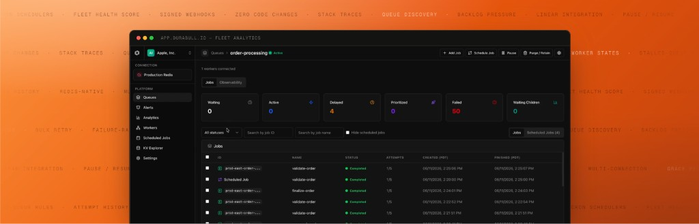

<p align="center">
  
</p>

<div align="center">
  <h1>Durabull</h1>
  <p><strong>The modern dashboard for BullMQ.</strong></p>
  <p>Monitor queues, inspect jobs, debug failures, and operate workers across Redis environments.</p>
  <p>
    <a href="https://durabull.io/documentation"><strong>Documentation</strong></a>
    <span> · </span>
    <a href="https://durabull.io"><strong>Hosted Product</strong></a>
  </p>
</div>

Durabull connects to the Redis instances used by your BullMQ applications. Monitor queue health,
inspect jobs and logs, retry failures, manage schedulers, and understand worker connectivity
across environments. The source is available under [Elastic License 2.0](LICENSE).

## Get started

| Goal | Guide |
| --- | --- |
| Use the hosted app | [Durabull Cloud](https://app.durabull.io) |
| Install on macOS or Windows | [Desktop apps](https://durabull.io/documentation/getting-started/desktop-apps) |
| Run a self-hosted instance | [Installation](https://durabull.io/documentation/self-hosting/installation) and [Docker Compose](https://durabull.io/documentation/deployment/docker) |
| Connect an AI assistant | [MCP server](https://durabull.io/documentation/integrations/mcp-server) |
| Contribute to the project | [Contributing](CONTRIBUTING.md) |

## Run from source

You need Bun `1.3.5`, Node.js `20.19+` or `22.12+`, and a reachable Redis instance.

```bash
git clone https://github.com/durabullhq/durabull.git
cd durabull
bun install --frozen-lockfile
```

For a minimal localhost run, start Redis if you do not already have it:

```bash
docker run -d --name durabull-dev-redis -p 127.0.0.1:6379:6379 redis:8-alpine
bun run dev:authless
```

Open **http://localhost:5173**. The API runs at **http://localhost:3001/api**.
The launcher supplies development-only auth and encryption secrets; it does not start Redis.
An empty Redis instance has no queues until a BullMQ application creates them.

Authless mode grants owner access to every visitor. Keep it on a trusted machine or behind access
controls. If a repository `.env` sets `DATABASE_URL`, the launcher still uses that PostgreSQL
instance; run `DATABASE_URL= bun run dev:authless` to use local PGlite instead.

For a seeded PostgreSQL + Redis stack, follow the complete
[local development guide](https://durabull.io/documentation/getting-started/local-development).
It covers `.env` setup, secret generation, Docker ports, sample login credentials, and demo traffic.

## Documentation

- [Product workflows](https://durabull.io/documentation/getting-started/how-to-use-durabull)
- [Authentication, connections, and persistence modes](https://durabull.io/documentation/getting-started/architecture-and-modes)
- [Environment variable reference](https://durabull.io/documentation/getting-started/environment-variables)
- [HTTP API reference](https://durabull.io/documentation/reference/http-api)
- [Troubleshooting](https://durabull.io/documentation/operations/troubleshooting)

To preview documentation changes, run `bun run dev:docs` and open
**http://localhost:3002/documentation**.

## Usage telemetry

Production Durabull, including desktop and self-hosted builds, collects anonymous/pseudonymous
usage telemetry to understand feature usage and improve the product. There is no product-level
telemetry opt-out. Configuring `POSTHOG_KEY` sends the full PostHog browser stream to your project
and does not disable Durabull's separately sanitized stream.

The sanitized Durabull stream excludes Redis URLs, queue names, Redis key names, job data, logs,
emails, names, organizations, hostnames, raw URLs, search patterns, stack traces, and raw error
messages. See the [telemetry disclosure](https://durabull.io/documentation/getting-started/environment-variables#anonymous-usage-telemetry)
for details.

## Repository map

| Path | Purpose |
| --- | --- |
| `apps/api` | Bun + Hono API, BullMQ operations, and MCP ingress |
| `apps/web` | React dashboard |
| `apps/docs` | Next.js documentation and marketing site |
| [apps/desktop](apps/desktop/README.md) | Electron shell and desktop build guide |
| [packages/auth](packages/auth/README.md) | Better Auth configuration and client helpers |
| `packages/dal` | Database schema, persistence, and repositories |
| `packages/mcp` | MCP transport, tool/resource catalogs, and output safety |
| [packages/fleet-demo-workload](packages/fleet-demo-workload/README.md) | Continuous demo workload |
| `tooling` | Environment configuration, scripts, and Docker files |

## License

[Elastic License 2.0 (ELv2)](LICENSE). Review the license terms before redistributing Durabull or
providing it as a hosted service.
